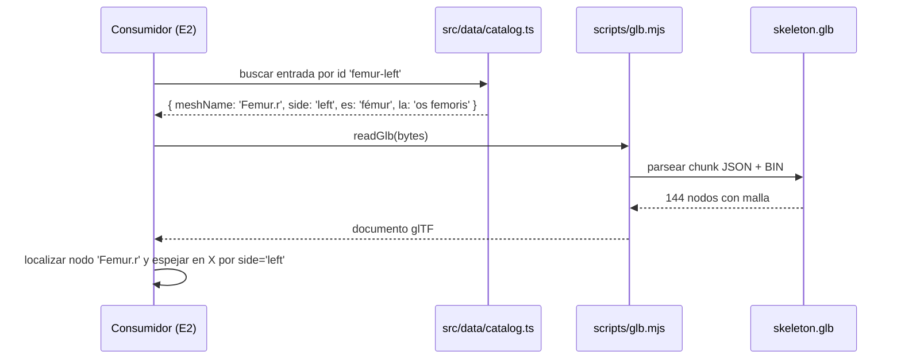
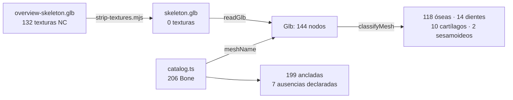

# Epic e1: Anatomical asset — Docs

Cómo funciona la capa de datos anatómicos, cómo extenderla y cómo
diagnosticarla cuando falle.

## Worked example

Pregunta que resuelve esta capa: **«¿qué hueso es la malla `Femur.r` del lado
izquierdo, y cómo se llama en ambos idiomas?»**

1. **Entrada.** El activo `src/data/skeleton.glb`, 1 907 624 bytes, 144 mallas
   nombradas, geometría comprimida con `KHR_draco_mesh_compression`.
2. **Lectura.** `readGlb(readFileSync('src/data/skeleton.glb'))` parsea la
   cabecera (magic `glTF`, versión 2), separa el chunk JSON del BIN y devuelve el
   documento glTF con el binario colgado en `__bin`.
3. **Inventario.** `classifyMesh('Femur.r')` separa el sufijo de lateralidad y
   devuelve `{ kind: 'bone', side: 'right', base: 'Femur' }`.
4. **Catálogo.** `catalog` contiene **dos** entradas ancladas a esa misma malla:

   ```ts
   { id: 'femur-right', meshName: 'Femur.r', side: 'right',
     es: 'fémur', la: 'os femoris', synonyms: ['hueso del muslo'], region: 'lower-limb' }
   { id: 'femur-left',  meshName: 'Femur.r', side: 'left',
     es: 'fémur', la: 'os femoris', synonyms: ['hueso del muslo'], region: 'lower-limb' }
   ```

5. **Salida.** Para el lado izquierdo, la entrada es `femur-left`: se muestra
   «fémur / os femoris». El render tendrá que **espejar** la geometría en X,
   porque el modelo solo trae el hemicuerpo derecho.



Para una malla cualquiera el patrón es el mismo: **la malla da la forma, el
catálogo da la identidad y el lado.**

## Extension guide

### Añadir un hueso al catálogo

1. Localizar su nombre de malla real —nunca construirlo por regla:

   ```bash
   node scripts/inventory-model.mjs --kind=bone | grep -i escafoides
   ```

2. Añadir la entrada en `src/data/catalog.ts`, en el bloque de su región:

   ```ts
   {
     id: 'scaphoid-right',
     meshName: 'Scaphoid.r',
     side: 'right',
     es: 'escafoides',
     la: 'os scaphoideum',
     synonyms: ['escafoides carpiano', 'navicular de la mano'],
     region: 'upper-limb',
   },
   ```

3. Si es un hueso par, **añadir las dos entradas**: el test
   `da a cada hueso par sus dos lados` falla con una sola.
4. Actualizar el recuento canónico en `src/data/catalog.coverage.test.ts` si la
   región cambia de tamaño — la constante `CANON` es deliberadamente explícita
   para que ampliar la cobertura sea una decisión, no un efecto colateral.
5. Verificar: `./scripts/check`.

### Añadir un hueso que el modelo no contiene

`meshName: null` **obliga** a `missingReason` —lo impone el tipo, no el test— y
la razón debe pasar de 20 caracteres:

```ts
{
  id: 'malleus-right', meshName: null, side: 'right',
  es: 'martillo', la: 'malleus', synonyms: ['hueso martillo'], region: 'ear',
  missingReason: 'Está alojado en la cavidad timpánica, dentro del hueso temporal…',
}
```

### Añadir una región anatómica

Añadirla a `BONE_REGIONS` en `src/data/bone.ts` (el tipo `BoneRegion` se deriva
del array) y darle su cuenta en `CANON`. Si sus huesos son impares, añadirla a
`UNPAIRED_REGIONS` o sus ids a `UNPAIRED_IDS`.

### Actualizar el modelo cuando AnatomyTOOL publique otra versión

```bash
node scripts/strip-textures.mjs nuevo.glb src/data/skeleton.glb
node scripts/inventory-model.mjs --kind=bone > /tmp/nuevo-inventario.txt
./scripts/check
```

El test de anclaje nombrará cada entrada cuyo `meshName` haya desaparecido. **No
hay que revisar el modelo a ojo**: el gate dice exactamente qué se rompió.

### Errores frecuentes

- **Construir el nombre de malla por regla.** No funciona: el modelo mezcla `2d`
  y `3rd` en la misma familia de falanges, y `Scapula.r.` lleva un punto de más.
- **Olvidar el segundo lado** de un hueso par.
- **Poner lado a una vértebra.** Toda la columna es impar; `isUnpaired` lo
  impone.
- **Usar el catálogo para decidir qué es hueso.** El modelo trae dientes,
  cartílagos costales y sesamoideos: los aparta `classifyMesh`, no el catálogo.

## Data flow

Dos tuberías, una de preparación (una vez) y otra de consumo (en cada uso).

**Preparación del activo** — se ejecuta a mano al incorporar o actualizar el modelo:

```
overview-skeleton.glb (AnatomyTOOL, 3,34 MB, 132 texturas CC BY-NC-SA)
        │  scripts/strip-textures.mjs
        │    · readGlb        → documento glTF + Buffer
        │    · quita images / textures / samplers y los *Texture de materiales
        │    · reconstruye el buffer sin los bufferView de imágenes
        │    · remapea accessors y KHR_draco_mesh_compression
        │  writeGlb           → Buffer
        ▼
src/data/skeleton.glb (1,86 MB, 0 texturas, 144 mallas intactas)
```

**Consumo**:

```
src/data/skeleton.glb ──readGlb──▶ Glb ──▶ nodes[].name : string
                                                  │
src/data/catalog.ts ──▶ Bone[] ──meshName──▶ anclaje ──▶ identidad + lado + nomenclatura
```

Tipos en cada frontera:

| Frontera | Tipo | Definido en |
|---|---|---|
| Archivo → memoria | `Glb` | `scripts/glb.d.mts` |
| Nombre de malla → clasificación | `MeshClassification` | `scripts/inventory.d.mts` |
| Entrada de catálogo | `Bone` = `MappedBone \| UnmappedBone` | `src/data/bone.ts` |
| Región | `BoneRegion` | `src/data/bone.ts` |



La dependencia va **del catálogo hacia la geometría**, nunca al revés: hay una
malla ósea sin entrada (`Manubrium of sternum`) y eso es legal por diseño.

## Invariants & contracts

| # | Invariante | Síntoma si se viola | Cómo comprobarlo |
|---|---|---|---|
| I1 | Todo `id` del catálogo es único | Dos huesos distintos se pisan al buscar por id | `npx vitest run src/data/catalog.test.ts` |
| I2 | Todo `meshName` no nulo existe en `skeleton.glb` | Un hueso invisible: la UI lo lista y no hay nada que resaltar | `npx vitest run tests/catalog-geometry.test.ts` — nombra la entrada culpable |
| I3 | `meshName: null` ⟺ `missingReason` presente | Una ausencia sin explicar, indistinguible de un olvido | Lo impone el **tipo**: la unión `Bone` no deja escribirlo |
| I4 | Un hueso par tiene sus dos lados; uno impar no tiene lado | Media pareja: solo se puede preguntar por el derecho | `npx vitest run src/data/catalog.coverage.test.ts` |
| I5 | El reparto por región coincide con `CANON` (206 en total) | La cobertura se degrada sin que nadie se entere | Misma prueba que I4 |
| I6 | El activo no contiene ningún byte de imagen | Se distribuye material CC BY-NC-SA dentro del producto | `npx vitest run tests/skeleton-asset.test.ts` — busca firmas PNG/JPEG/WEBP/KTX |
| I7 | El activo conserva las 144 mallas del original | Una transformación perdió geometría en silencio | Misma prueba que I6 |
| I8 | `src/data/` no importa React, DOM ni almacenamiento | La capa de datos deja de ser reutilizable fuera del navegador | `grep -rn "react\|document\|localStorage" src/data/*.ts` |

## Failure-mode catalog

### «El gate falla diciendo que una entrada apunta a una malla inexistente»

- **Síntoma:** `entradas que apuntan a una malla inexistente: [ 'femur-right -> Femur.right' ]`
- **Causa:** el `meshName` está mal escrito, o el modelo se actualizó y renombró
  la malla.
- **Diagnóstico:** `node scripts/inventory-model.mjs --kind=bone | grep -i femur`
  da el nombre real.
- **Arreglo:** corregir el `meshName` de la entrada. Si desapareció del modelo,
  convertirla en ausencia declarada con su razón.

### «Añadí un hueso y el recuento por región falla»

- **Síntoma:** `región upper-limb: expected 61 to be 60`
- **Causa:** `CANON` en `catalog.coverage.test.ts` es explícito a propósito.
- **Diagnóstico:** comparar la cuenta real con la canónica de esa región.
- **Arreglo:** si el hueso debe estar, actualizar `CANON` **y** el total de 206
  conscientemente. Si no, quitar la entrada. Nunca ajustar `CANON` solo para
  que pase.

### «Un hueso par solo aparece de un lado»

- **Síntoma:** `huesos pares con un solo lado: [ 'escafoides' ]`
- **Causa:** se añadió `-right` y se olvidó `-left`.
- **Diagnóstico:** `grep -n "escafoides" src/data/catalog.ts` — deben salir dos.
- **Arreglo:** añadir la entrada del lado que falta, con el **mismo** `meshName`
  (el modelo solo trae el derecho).

### «TypeScript rechaza mi entrada y no entiendo por qué»

- **Síntoma:** `Type 'string' is not assignable to type 'undefined'` sobre
  `missingReason`.
- **Causa:** la unión discriminada de I3: una entrada con malla **no puede**
  llevar razón de ausencia.
- **Diagnóstico:** mirar si `meshName` es `null` o no.
- **Arreglo:** quitar `missingReason` si el hueso tiene geometría; ponerlo si no.

### «Actualicé el modelo y el activo pesa lo mismo que el original»

- **Síntoma:** `src/data/skeleton.glb` no adelgazó tras la poda.
- **Causa:** se borraron las referencias pero no se compactó el buffer, así que
  los bytes de las texturas siguen dentro. **Es el fallo silencioso más grave de
  esta capa: sería legal, no funcional** — distribuir material no comercial.
- **Diagnóstico:** `npx vitest run tests/skeleton-asset.test.ts`; la prueba de
  firmas de imagen es la que lo detecta. Manualmente:
  `python3 -c "print(open('src/data/skeleton.glb','rb').read().count(b'\x89PNG'))"`
- **Arreglo:** reejecutar `scripts/strip-textures.mjs`, que reconstruye el
  buffer en vez de solo desreferenciar. Lección registrada en la retrospectiva
  de e1.1.

### «Escribí una herramienta que genera nombres de malla y falla en algunos huesos»

- **Síntoma:** funciona para el fémur y falla en las falanges.
- **Causa:** los nombres del modelo son irregulares por composición histórica
  —`2d` junto a `3rd`, `1st metacarpal` junto a `First metatarsal`—. Registrado
  en el `Learned` de la retrospectiva del epic.
- **Diagnóstico:** `node scripts/inventory-model.mjs --json` y comparar contra
  lo que la herramienta generó.
- **Arreglo:** leer la lista real; no derivar nombres por regla. Nunca.
