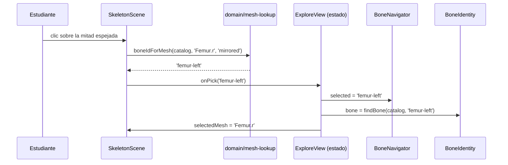
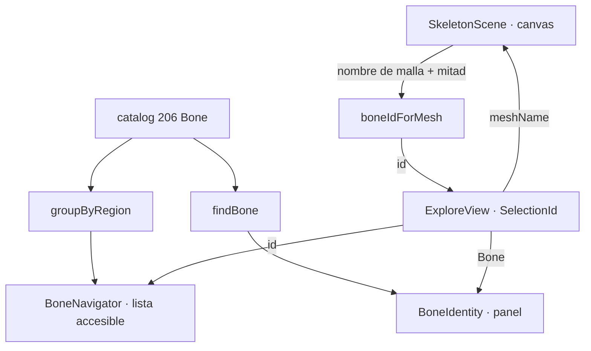

# Epic e2: Explore skeleton — Docs

Cómo funciona la vista de exploración, cómo añadirle una proyección más y cómo
diagnosticarla cuando algo se desincronice.

## Worked example

**«Un estudiante hace clic sobre el fémur izquierdo del esqueleto.»**

1. **Entrada.** El raycaster de three devuelve el objeto pulsado:
   `evento.object.name === 'Femur.r'`. El modelo solo trae el hemicuerpo derecho,
   así que esa malla existe **dos veces** en la escena.
2. **Qué mitad.** El clic ocurrió sobre la copia con `scale=[-1, 1, 1]`, que se
   renderiza con `half="mirrored"`.
3. **Resolución.** `boneIdForMesh(catalog, 'Femur.r', 'mirrored')` filtra el
   catálogo: hay dos candidatos, `femur-right` y `femur-left`; la mitad espejada
   corresponde al lado `left`, así que devuelve **`'femur-left'`**.
4. **Estado.** `toggleSelection(null, 'femur-left')` → `'femur-left'`.
5. **Las tres proyecciones**, del mismo estado:
   - `BoneNavigator` marca `aria-pressed="true"` en el botón «fémur izquierdo».
   - `BoneIdentity` muestra «fémur» / *os femoris*, región Miembro inferior, lado
     izquierdo, y lo anuncia en `role="status"`.
   - `SkeletonScene` recibe `selectedMesh = 'Femur.r'` y enciende el material
     emisivo de esa malla **en ambas copias**.

Nótese el paso 5: la escena recibe **la malla**, no el identificador. Es la
asimetría central del epic.



## Extension guide

### Añadir una cuarta proyección del estado (p. ej. una ficha, E3)

El estado vive en `ExploreView` y se reparte ya traducido. Para sumar una vista:

```tsx
// src/features/explore/ExploreView.tsx
<BoneDetail bone={findBone(catalog, selected)} />
```

1. Recibe `Bone | undefined` si necesita datos; `string | null` si solo necesita
   el `meshName`.
2. **No guardes estado propio.** Si la nueva vista permite seleccionar, recibe un
   `onSelect` y llama a `toggleSelection`.
3. Añade una aserción a `ExploreView.test.tsx` en la familia de «nunca marca más
   de un hueso a la vez».

### Añadir una etiqueta de región o de lado

`src/components/labels.ts` es la única fuente. Cambiarla ahí se refleja en el
navegador y en el panel a la vez.

### Probar un componente que use la escena

Sustituye la escena por un doble **que exponga lo que recibe**, no por un `<div>`
mudo:

```tsx
vi.mock('../../components/SkeletonScene', () => ({
  SkeletonScene: ({ selectedMesh, onPick }) => (
    <div data-testid="escena-sustituida" data-malla={selectedMesh ?? ''}>
      <button type="button" onClick={() => onPick('tibia-left')}>simular clic</button>
    </div>
  ),
}))
```

Así la costura queda probada aunque WebGL no exista en jsdom.

### Errores frecuentes

- **Pasar el `id` a la escena.** La escena habla de mallas; el `id` no le sirve.
- **Deducir el lado del nombre de la malla.** Imposible: `Femur.r` es los dos
  fémures. El lado sale de la mitad de la escena.
- **Tocar un material sin clonarlo.** Las dos copias comparten materiales: ver el
  catálogo de fallos.
- **Añadir un estado local de selección** en una vista. Rompe la invariante de
  «exactamente uno marcado».

## Data flow

```
catalog: Bone[]  ──groupByRegion──▶  RegionGroup[]  ──▶  BoneNavigator
                                                              │ onSelect(id)
                                                              ▼
                                              ExploreView: SelectionId
                                    ┌──────────────┬──────────┴───────────┐
                          findBone(id)      selectedMesh              onPick(id)
                                    ▼              ▼                       ▲
                             BoneIdentity   SkeletonScene ──boneIdForMesh──┘
```

| Frontera | Tipo | Definido en |
|---|---|---|
| Estado de selección | `SelectionId = string \| null` | `src/domain/selection.ts` |
| Grupo de región | `RegionGroup` | `src/domain/regions.ts` |
| Mitad de la escena | `SceneHalf = 'original' \| 'mirrored'` | `src/domain/mesh-lookup.ts` |
| Lo que recibe la escena | `selectedMesh: string \| null` | `src/components/SkeletonScene.tsx` |



## Invariants & contracts

| # | Invariante | Síntoma si se viola | Cómo comprobarlo |
|---|---|---|---|
| I1 | Hay **exactamente un** hueso con `aria-pressed="true"`, o ninguno | Dos huesos parecen elegidos; el panel discrepa de la lista | `ExploreView.test.tsx` → «nunca marca más de un hueso a la vez» |
| I2 | La escena recibe `meshName`, nunca un `id` | La escena no resalta nada: `femur-left` no es ninguna malla | `ExploreView.test.tsx` → «pasa a la escena la malla, no su identificador» |
| I3 | El lado de un hueso par lo decide la mitad de la escena | Al pulsar el fémur izquierdo se selecciona el derecho | `mesh-lookup.test.ts` → mitad original frente a espejada |
| I4 | Una malla no catalogada no selecciona nada | Pulsar un diente o el manubrio selecciona un hueso equivocado | `mesh-lookup.test.ts` → «no inventa nada» |
| I5 | Todo hueso presentado tiene nombre accesible con su lado | Un lector de pantalla dice «botón» y nada más | `BoneNavigator.test.tsx` → búsqueda por rol y nombre |
| I6 | La selección se comunica por más de un canal, nunca solo por color | Quien no distingue el resaltado no sabe qué eligió | `BoneNavigator.test.tsx` (`aria-pressed`) + `BoneIdentity.test.tsx` (`role="status"`) |
| I7 | `src/domain/` no importa React, three, DOM ni almacenamiento | El dominio deja de probarse sin navegador | `grep -rn "react\|three\|document\|localStorage" src/domain/*.ts` |
| I8 | Ninguna petición de red en ejecución | Se incumple `must-privacy-006` | `SkeletonScene.test.tsx` → sin URLs externas; decodificador en `public/draco/` |

## Failure-mode catalog

### «Resalté un hueso y se encendió también el del otro lado»

- **Síntoma:** al elegir el fémur derecho, el izquierdo brilla igual.
- **Causa:** `scene.clone(true)` de three **comparte los materiales** entre
  copias. Tocar el material de una malla afecta a las dos.
- **Diagnóstico:** comprobar si `malla.userData.ownMaterial` está puesto antes de
  modificar el material.
- **Arreglo:** clonar el material la primera vez que se toca cada malla, como
  hace `SkeletonHalf`. Registrado en la retrospectiva de e2.5.

### «Las pruebas de la vista fallan con ResizeObserver is not defined»

- **Síntoma:** `This browser does not support ResizeObserver out of the box`.
- **Causa:** jsdom no lo implementa y react-three-fiber lo necesita para medir el
  canvas.
- **Diagnóstico:** el fallo aparece en cuanto un test monta un árbol que incluye
  la escena real.
- **Arreglo:** el polyfill de `tests/setup.ts`, y sustituir la escena por un doble
  en las pruebas de DOM. El polyfill **no** hace que WebGL funcione.

### «Hago clic en el esqueleto y no se selecciona nada»

- **Síntoma:** el clic no tiene efecto en ciertas zonas.
- **Causa esperable:** la malla pulsada no está catalogada — dientes, cartílagos
  costales, sesamoideos y `Manubrium of sternum` son mallas legítimas del modelo
  sin entrada.
- **Diagnóstico:** `node scripts/inventory-model.mjs --json` y buscar el nombre;
  si su `kind` no es `bone`, el comportamiento es el correcto.
- **Arreglo:** ninguno si es una de esas. Si es un hueso de verdad, falta su
  entrada en el catálogo y el test de anclaje de E1 debería haberlo dicho.

### «Al pulsar un hueso se selecciona el del lado contrario»

- **Síntoma:** clic en el lado izquierdo, se marca el derecho.
- **Causa:** la mitad que se pasa a `boneIdForMesh` no corresponde a la copia
  pulsada.
- **Diagnóstico:** comprobar que la copia con `scale=[-1, 1, 1]` es la que recibe
  `half="mirrored"`.
- **Arreglo:** alinear escala y `half`. La aserción de `mesh-lookup.test.ts` con
  las dos mitades es la que lo protege.

### «La escena está en negro»

- **Síntoma:** el canvas aparece pero no hay esqueleto.
- **Causa probable:** el decodificador Draco no se cargó.
- **Diagnóstico:** pedir `/draco/draco_decoder.wasm` — debe responder 200 con
  unos 192 KB. Comprobar también que el `.glb` se sirve.
- **Arreglo:** volver a copiar el decodificador desde
  `node_modules/three/examples/jsm/libs/draco/gltf/`. **No** apuntar al CDN de
  gstatic: incumpliría `must-privacy-006` (ver parking lot).

### «Un componente nuevo se desincroniza de la lista»

- **Síntoma:** el panel dice un hueso y la lista marca otro.
- **Causa:** la vista nueva guarda estado propio en vez de recibirlo.
- **Diagnóstico:** buscar `useState` en componentes que no sean `ExploreView`.
- **Arreglo:** subir el estado a `ExploreView` y recibirlo por props. La
  invariante I1 lo detecta si hay un test que la ejerza.
