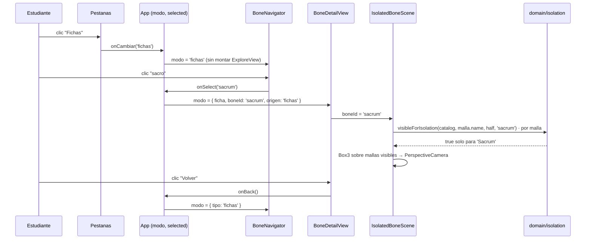

# Epic e3: Ficha del hueso — Docs

Cómo aísla la aplicación un hueso del resto del esqueleto, cómo llega ahí un
estudiante por dos caminos distintos, y cómo diagnosticarlo cuando algo no
encuadra o no vuelve a donde debería.

## Worked example

**«Un estudiante abre la aplicación, entra a la pestaña "Fichas" sin haber
tocado la escena 3D, y elige el sacro.»**

1. **Estado inicial.** `App` monta con `modo = { tipo: 'explorar' }`. Al
   pulsar la pestaña "Fichas", `Pestanas` llama
   `onCambiar('fichas')` → `setModo({ tipo: 'fichas' })`. `ExploreView` (y
   con ella `SkeletonScene`, el canvas WebGL) **nunca se monta**.
2. **La lista.** En modo `'fichas'`, `App` renderiza `BoneNavigator` — el
   mismo componente de E2, sin modificar — con `selected={null}` (nada
   marcado, porque acá no hay "selección" en el sentido de E2) y
   `onSelect` apuntando a
   `(id) => setModo({ tipo: 'ficha', boneId: id, origen: 'fichas' })`.
3. **El clic.** El estudiante pulsa el botón "sacro" → `onSelect('sacrum')`
   → `modo = { tipo: 'ficha', boneId: 'sacrum', origen: 'fichas' }`.
4. **`BoneDetailView` monta.** Recibe `boneId = 'sacrum'`,
   `bone = findBone(catalog, 'sacrum')`. Renderiza `IsolatedBoneScene` y
   `BoneIdentity` de solo lectura (sin `onViewDetail`).
5. **Dentro de `IsolatedBoneScene`:** para cada malla de las dos copias del
   modelo (`original` y `mirrored`),
   `visibleForIsolation(catalog, malla.name, half, 'sacrum')` decide su
   `.visible`. Para la malla `'Sacrum'`, `boneIdForMesh` no encuentra
   ambigüedad (un solo candidato en el catálogo) y devuelve `'sacrum'` en
   **ambas** mitades — coincide con el `targetId`, así que la malla
   `Sacrum` queda visible en las dos copias (superpuestas, se ven como una
   sola). Cualquier otra malla —`Femur.r`, `Lower canine.r`, lo que sea—
   devuelve un id distinto o `null`, y queda oculta.
6. **Encuadre.** Tras aplicar la visibilidad, `IsolatedGroup` recorre el
   grupo y acumula un `Box3` **solo con las mallas visibles**. Con una
   única malla visible, el centro y la dimensión mayor de esa caja fijan la
   posición de un `<PerspectiveCamera>` de drei, montado recién cuando el
   encuadre está listo (no en el `camera` de `Canvas`, que solo se lee al
   montar).
7. **"Volver".** `BoneDetailView` llama `onBack`, que en `App` es
   `() => setModo({ tipo: modo.origen })` — como `origen === 'fichas'`,
   regresa a la lista, no a `ExploreView`.



## Extension guide

### Sumar un tercer origen a `BoneDetailView` (p. ej. desde un resultado de test, E4)

El patrón de "origen" existe justo para esto — no hace falta tocar
`BoneDetailView` ni `IsolatedBoneScene`, solo `App.tsx`:

```tsx
// src/App.tsx
type Modo =
  | { tipo: 'explorar' }
  | { tipo: 'fichas' }
  | { tipo: 'test' }                                    // nuevo
  | { tipo: 'ficha'; boneId: string; origen: 'explorar' | 'fichas' | 'test' }
```

1. Agregar el literal al tipo `origen` y al tipo `Modo`.
2. Donde sea que el modo test decida mostrar una ficha:
   `setModo({ tipo: 'ficha', boneId, origen: 'test' })`.
3. `onBack` en `BoneDetailView` ya funciona sin cambios —
   `() => setModo({ tipo: modo.origen })` resuelve el nuevo caso solo.
4. **Qué probar después:** un test de integración en `App.test.tsx` que
   confirme que "Volver" desde ese origen regresa al modo `'test'`, no a
   `'explorar'` por defecto — el error más fácil es olvidar pasar `origen`
   y dejar que TypeScript no lo note porque `boneId` sigue siendo válido.

### Aislar un hueso desde otro punto de la aplicación (sin pasar por `BoneDetailView`)

`IsolatedBoneScene` no sabe nada de modos ni de navegación — solo necesita
`bones` y `boneId`:

```tsx
import { IsolatedBoneScene } from './components/IsolatedBoneScene'

<IsolatedBoneScene bones={catalog} boneId="femur-left" />
```

**Error común:** pasar un `meshName` en vez de un `id` de catálogo. La
firma pide `boneId: string` sin más contexto en el tipo — nada avisa en
tiempo de compilación si se pasa `'Femur.r'` en vez de `'femur-left'`; el
síntoma es una escena vacía (`visibleForIsolation` no encuentra coincidencia
para ningún `targetId` que no sea un `id` real del catálogo).

## Data flow

```
clic en un hueso (BoneNavigator o BoneIdentity)
  → id de catálogo (string), nunca meshName
  → App: setModo({ tipo: 'ficha', boneId, origen })
  → BoneDetailView: findBone(catalog, boneId) → Bone | undefined
       ├─→ BoneIdentity (solo lectura): nombre, región, lateralidad
       └─→ IsolatedBoneScene: boneId → visibleForIsolation() por malla
                → Box3 sobre mallas visibles → { distance, center }
                → PerspectiveCamera
```

- `domain/isolation.ts` — `visibleForIsolation(bones, meshName, half,
  targetId): boolean`. Sin estado, sin React, sin three.js: reutiliza
  `boneIdForMesh` de `domain/mesh-lookup.ts` (E2), no lo reimplementa.
- `components/IsolatedBoneScene.tsx` — única pieza que sabe de three.js en
  esta épica. Su único contrato de entrada es `{ bones, boneId }`; produce
  un `<Canvas>` autocontenido.
- `features/bone-detail/BoneDetailView.tsx` — composición pura de
  `IsolatedBoneScene` + `BoneIdentity`, sin lógica propia más allá de
  resolver el `Bone` por `id`.
- `App.tsx` — único lugar que conoce los tres modos y decide a dónde
  vuelve "Volver". Ninguna vista (`ExploreView`, `BoneDetailView`, la lista
  de `'fichas'`) conoce a las otras.

## Invariants & contracts

- **La identificación es siempre por `id` de catálogo, nunca por
  `meshName`.** Mismo invariante que E2 (ADR-002/b2.1). Síntoma de
  violación: una ficha vacía o con el hueso equivocado pese a que el clic
  original fue correcto. Cómo comprobarlo: `grep -n "boneId" src/App.tsx
  src/features/bone-detail/*.tsx` y confirmar que ningún valor viene de
  `evento.object.name` o de un `meshName` crudo.
- **`ExploreView` es controlada, no dueña de su selección.** `selected` y
  `onSelect` son props obligatorias desde e3.2; un componente que la monte
  sin ellas no compila. Si una selección "se pierde" al navegar, el primer
  sospechoso es un lugar nuevo que monte `ExploreView` con su propio
  `useState` en vez de recibir el de `App`.
- **`IsolatedBoneScene` nunca oculta por casos especiales.** Toda malla sin
  entrada en el catálogo (dientes, cartílagos, sesamoideos — 26 de 144,
  confirmado con `node scripts/inventory-model.mjs`) se oculta por el mismo
  camino que "otro hueso": `boneIdForMesh` devuelve `null`, que nunca
  coincide con el `targetId`. Si aparece un `if` que compruebe
  explícitamente `meshName.includes('tooth')` o similar en
  `IsolatedBoneScene`/`isolation.ts`, es una señal de que este invariante
  se rompió.
- **El encuadre de `IsolatedBoneScene` se calcula sobre mallas visibles
  únicamente**, nunca con `Box3.setFromObject()` directo sobre el grupo
  completo (eso incluiría las mallas ocultas en el cálculo). Síntoma de
  violación: el hueso aparece diminuto en el centro del lienzo, rodeado de
  espacio vacío que corresponde al tamaño del esqueleto completo.

## Failure-mode catalog

### La ficha se ve vacía (ninguna malla visible)

- **Síntoma:** `IsolatedBoneScene` monta, no hay error en consola, pero el
  lienzo queda negro.
- **Causa raíz:** `boneId` no coincide con ningún `id` real del catálogo
  (typo, o se pasó un `meshName` por error — ver Extension guide).
- **Diagnóstico:** `catalog.find(b => b.id === boneId)` en la consola del
  navegador; si devuelve `undefined`, el id está mal, no la escena.
- **Fix:** corregir el `id` en el punto donde se llama a
  `IsolatedBoneScene`/`BoneDetailView`, nunca en `visibleForIsolation` —
  esa función ya hace lo correcto ante un id inexistente (nada visible, sin
  romper), que es el comportamiento esperado en ese caso, no un bug.

### "Volver" lleva al lugar equivocado

- **Síntoma:** desde la lista de "Fichas", "Volver" termina en
  `ExploreView` (o viceversa).
- **Causa raíz:** un nuevo punto de entrada a `BoneDetailView` que no pasó
  `origen`, o lo pasó con el valor fijo equivocado.
- **Diagnóstico:** `grep -n "origen:" src/App.tsx` — cada
  `setModo({ tipo: 'ficha', ... })` debe fijar `origen` según desde dónde
  se llamó, nunca un valor constante.
- **Fix:** corregir el `origen` en el `onSelect`/`onViewDetail` que originó
  la navegación.

### La selección de `ExploreView` se pierde al volver de la ficha

- **Síntoma:** seleccionar un hueso, abrir su ficha, volver — la lista ya
  no lo marca.
- **Causa raíz:** `selected` dejó de vivir en `App` (por ejemplo, alguien
  "simplificó" devolviendo el `useState` a `ExploreView`, deshaciendo la
  decisión de e3.2 sin darse cuenta de por qué existía).
- **Diagnóstico:** `grep -n "useState<SelectionId>" src` — debe aparecer
  una sola vez, en `App.tsx`.
- **Fix:** revertir el estado a `App`, pasando `selected`/`onSelect` como
  props controladas a `ExploreView` — ver
  `.claude/memory/state-ownership-follows-survival-not-cleanliness.md`.

### El hueso aislado aparece diminuto o descentrado

- **Síntoma:** se ve, pero ocupa una fracción pequeña del lienzo, o no
  está centrado.
- **Causa raíz:** el `Box3` del encuadre se calculó antes de que
  `grupo.updateMatrixWorld(true)` corriera, o incluyó mallas ocultas.
- **Diagnóstico:** revisar `IsolatedGroup` en `IsolatedBoneScene.tsx` — el
  orden dentro del `useLayoutEffect` importa: aplicar visibilidad,
  actualizar matrices, **después** recorrer para el `Box3`, filtrando
  `!malla.visible`.
- **Fix:** restaurar ese orden si se reordenó por accidente en un refactor.

### La prueba de la rejilla de clics de s1 no aplica acá

`IsolatedBoneScene` no tiene una prueba de integración en navegador
equivalente a la de `SkeletonScene` (`story/s1/browser-integration-suite`,
pausada — ver `records/parking-lot.md`, 2026-08-17). Toda verificación
visual de esta épica fue manual (capturas Playwright ad hoc, no
retenidas). Si aparece un defecto de renderizado que las capturas
manuales no atraparon, considerar extender esa suite (una vez destapada)
en vez de escribir una paralela.
