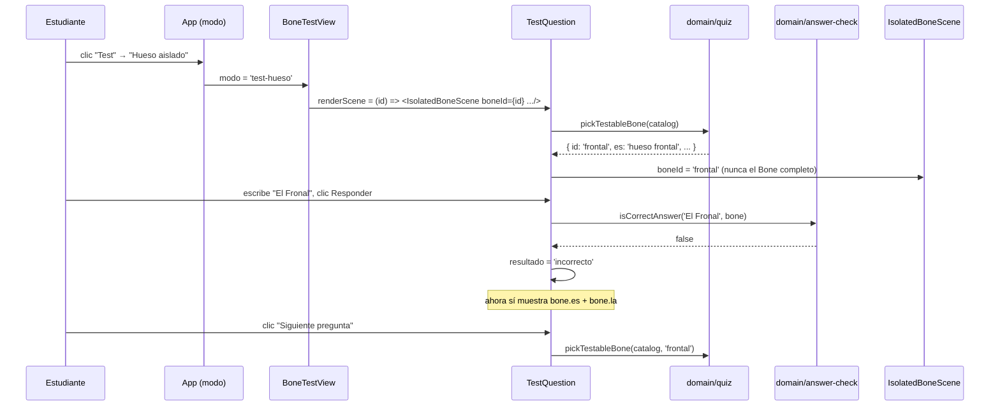

# Epic e4: Motor de test — Docs

Cómo funciona el flujo de pregunta-respuesta-corrección, cómo sumarle una
tercera variante de presentación, y cómo diagnosticarlo cuando una
respuesta válida se rechaza o un nombre se filtra antes de tiempo.

## Worked example

**«Un estudiante entra a la pestaña "Test", elige "Hueso aislado", y le
toca el hueso frontal.»**

1. **Elección de variante.** `App` monta `ElegirVarianteDeTest`; el clic en
   "Hueso aislado" → `setModo({ tipo: 'test-hueso' })` → se monta
   `BoneTestView`.
2. **La pregunta.** `BoneTestView` monta
   `<TestQuestion bones={catalog} renderScene={...} />`. `TestQuestion`
   inicializa `bone = pickTestableBone(catalog)` — supongamos que cae
   `{ id: 'frontal', es: 'hueso frontal', la: 'os frontale', synonyms:
   ['frontal'], meshName: 'Frontal bone', ... }`. Solo `bone.id` (`'frontal'`)
   se pasa a `renderScene`; el resto del objeto `Bone` nunca sale de
   `TestQuestion` mientras la pregunta está activa — es el contrato de
   `must-data-003`.
3. **La escena.** `renderScene('frontal')` monta
   `<IsolatedBoneScene bones={catalog} boneId="frontal"
   accessibleLabel="Un hueso está señalado, aislado del resto del
   esqueleto..." />`. Para cada malla de las dos mitades del modelo,
   `visibleForIsolation(catalog, malla.name, half, 'frontal')` decide su
   visibilidad — solo `'Frontal bone'` queda visible en ambas mitades (hueso
   impar). El `aria-label` del lienzo es el texto genérico, no
   `"hueso frontal, aislado en 3D"` (ese es el valor por defecto, para
   `BoneDetailView`).
4. **La respuesta.** El estudiante escribe `"El Fronal"` (con typo).
   `isCorrectAnswer('El Fronal', bone)` normaliza a `'fronal'` — no coincide
   con `'frontal'` normalizado. **Incorrecto.**
5. **La corrección.** `resultado = 'incorrecto'` → `TestQuestion` muestra
   `"Incorrecto"` + `"hueso frontal / os frontale"`. La escena no cambia:
   sigue mostrando el hueso frontal aislado, ahora con su nombre visible
   junto a ella.
6. **Siguiente.** Clic en "Siguiente pregunta" →
   `pickTestableBone(catalog, 'frontal')` — cualquier hueso preguntable
   excepto el frontal — y el ciclo vuelve al paso 2.



## Extension guide

### Sumar una tercera variante de presentación (p. ej. si un futuro requisito pide preguntar sobre una región del esqueleto)

`TestQuestion` no sabe nada de qué escena existe — solo pide
`renderScene: (boneId: string) => ReactNode`:

```tsx
// src/features/test/RegionTestView.tsx (hipotético)
import { TestQuestion } from './TestQuestion'

export function RegionTestView() {
  return (
    <TestQuestion
      bones={catalog}
      renderScene={(boneId) => <RegionScene bones={catalog} boneId={boneId} />}
    />
  )
}
```

1. La nueva escena solo necesita aceptar `boneId: string` y no revelar el
   nombre del hueso en ningún `aria-label`/texto antes de que
   `TestQuestion` decida mostrarlo (ver Failure-mode catalog).
2. **Qué probar después:** un test de `must-data-003` idéntico en forma al
   de `BoneTestView.test.tsx` — recorrer el catálogo completo contra
   `textContent` **y** contra todo `[aria-label]` del DOM renderizado, no
   solo uno de los dos.
3. **Error común:** pasar el `Bone` completo a la nueva escena "por
   comodidad" en vez de solo el `id`. La firma de `renderScene` ya lo hace
   difícil a propósito (ver `domain/isolation.ts` y
   `TestQuestion.tsx`), pero una escena nueva podría añadir su propio prop
   `bone: Bone` sin darse cuenta de que reintroduce el riesgo.

### Sumar un tercer origen para "Volver" desde una ficha (RF-03) — no aplica directamente a e4, pero el patrón es el mismo

Ver `work/epics/e3-bone-detail/docs.md`, sección "Extension guide" — e4 no
lo repite porque no lo necesitó (el modo test no tiene "Volver a").

## Data flow

```
pickTestableBone(catalog, excluirId?)
  → Bone completo, solo dentro de TestQuestion
  → renderScene(bone.id: string)          — cruza el límite solo como id
       └─→ IsolatedBoneScene / SkeletonScene: boneId → visibilidad/resaltado
  → estudiante escribe una respuesta (string)
  → isCorrectAnswer(respuesta, bone) → boolean
       └─→ normalizeAnswer() aplicada a ambos lados de la comparación
  → resultado: 'pendiente' | 'correcto' | 'incorrecto'
       └─→ solo si 'incorrecto': bone.es, bone.la cruzan a texto visible
```

- `domain/quiz.ts` — `pickTestableBone(bones, excluirId?): Bone`. Sin
  estado, sin memoria de historial (eso es `RF-09`/E5).
- `domain/answer-check.ts` — `normalizeAnswer(texto): string`,
  `isCorrectAnswer(respuesta, hueso): boolean`. Puro, sin React.
- `features/test/TestQuestion.tsx` — único lugar que sostiene el ciclo
  pregunta→respuesta→corrección→siguiente. No sabe renderizar una escena
  por sí mismo.
- `features/test/{Skeleton,Bone}TestView.tsx` — composición de una línea
  cada una: `TestQuestion` + la escena correspondiente con su
  `accessibleHint`/`accessibleLabel` no revelador.

## Invariants & contracts

- **`TestQuestion` nunca pasa el `Bone` completo a `renderScene`, solo su
  `id`.** Violación: cualquier prop `bone: Bone` en una escena de test.
  Cómo comprobarlo: `grep -n "renderScene" src/features/test/*.tsx` — la
  firma debe seguir siendo `(boneId: string) => ReactNode`.
- **Ningún nombre de hueso llega al DOM —ni a `textContent` ni a
  `aria-label`— antes de que `resultado !== 'pendiente'`**
  (`must-data-003`). Cómo comprobarlo: correr
  `npx vitest run src/features/test` y confirmar que los casos
  `must-data-003` de `TestQuestion.test.tsx` y `BoneTestView.test.tsx`
  pasan. Si se agrega una escena nueva, replicar ambas mitades de la
  prueba (texto y `aria-label`) para ella también.
- **La validación de respuesta es simétrica**: `normalizeAnswer` se aplica
  igual a lo que escribe el estudiante y a `es`/`la`/cada `synonym` del
  catálogo. Violación: cualquier comparación que normalice un lado y no el
  otro. Cómo comprobarlo: `isCorrectAnswer` en `answer-check.ts` siempre
  llama `normalizeAnswer` sobre ambos operandos antes de comparar.
- **`pickTestableBone` nunca elige un hueso sin `meshName`.** Violación:
  una pregunta sobre un hueso ausente del modelo (imposible de resaltar o
  aislar). Cómo comprobarlo: el filtro `bone.meshName !== null` en
  `quiz.ts` es la única fuente de "preguntable".

## Failure-mode catalog

### Una respuesta que "debería" ser correcta se rechaza

- **Síntoma:** el estudiante escribe algo que suena bien y el sistema dice
  "Incorrecto".
- **Causa raíz:** la forma escrita no coincide, tras normalizar, con `es`,
  `la` ni ningún `synonym` del catálogo para ese hueso — el más común es un
  sinónimo que el catálogo no registra.
- **Diagnóstico:** `normalizeAnswer('lo que escribió')` en la consola del
  navegador, comparar contra `normalizeAnswer(bone.es)` /
  `normalizeAnswer(bone.la)` / cada `normalizeAnswer(s)` de
  `bone.synonyms`.
- **Fix:** si es una forma legítima que falta, se agrega a `synonyms` en
  `data/catalog.ts` — nunca se relaja `normalizeAnswer` para "adivinar" más
  de lo que `RF-06` pide (ver ADR implícito en el brief: "no inventa
  tolerancia más allá de la que RF-06 especifica").

### La `ñ` (o una letra similar) se compara mal

- **Síntoma:** una respuesta con una letra distinta a una vocal acentuada
  se acepta o rechaza de forma inesperada.
- **Causa raíz:** ver `.claude/memory/self-consistent-checks-hide-
  systematic-bugs.md` — `normalizeAnswer` reemplaza vocales acentuadas
  explícitamente (`VOCALES_ACENTUADAS` en `answer-check.ts`), nunca
  `normalize('NFD')` genérico, precisamente por este bug ya encontrado y
  arreglado en e4.1.
- **Diagnóstico:** `grep -n "VOCALES_ACENTUADAS" src/domain/answer-check.ts`
  — si alguien lo reemplazó por una descomposición Unicode genérica, ahí
  está el problema.
- **Fix:** revertir a reemplazos explícitos por vocal, nunca NFD + strip de
  diacríticos genérico.

### Un nombre de hueso aparece en el DOM antes de responder

- **Síntoma:** `must-data-003` falla, o un lector de pantalla anuncia el
  hueso antes de que el estudiante responda.
- **Causa raíz real, ya ocurrida:** una escena reutilizada de otra parte de
  la aplicación (`IsolatedBoneScene`, construida para `BoneDetailView` en
  e3.2) trae un valor por defecto que nombra el hueso — en un `aria-label`,
  no en texto visible, así que una prueba que solo mire `textContent` no lo
  ve (e4.4, commit `0327f42`).
- **Diagnóstico:**
  `document.querySelectorAll('[aria-label]')` en la consola, revisar cada
  valor contra el catálogo — no alcanza con mirar el texto visible de la
  página.
- **Fix:** toda escena montada dentro de `TestQuestion` necesita su prop de
  accesibilidad configurable (`accessibleHint` en `SkeletonScene`,
  `accessibleLabel` en `IsolatedBoneScene`) fijada explícitamente a un texto
  genérico — nunca el valor por defecto de la escena, que asume un
  contexto donde revelar el nombre es correcto.

### Un hueso aislado no se ve en el modo test (lienzo en blanco, sin error)

- **Síntoma:** `BoneTestView` monta, no hay error en consola, el lienzo
  queda vacío.
- **Causa raíz real, ya ocurrida:** el plano cercano (`near`) por defecto
  de three.js recorta la cámara calculada por `distanceToFit` cuando el
  hueso es muy pequeño (e4.4, commit `47ce296` — ver
  `.claude/memory/verify-extreme-sizes-not-just-typical-ones.md`).
- **Diagnóstico:** probar con un hueso conocido por chico (una falange,
  una cuña) — si el lienzo queda vacío solo con huesos pequeños y no con
  huesos grandes, es este bug.
- **Fix:** confirmar que `PerspectiveCamera` en `IsolatedBoneScene.tsx`
  sigue teniendo `near={0.001}` (o un valor igual de bajo) — no el default
  de three.js.
