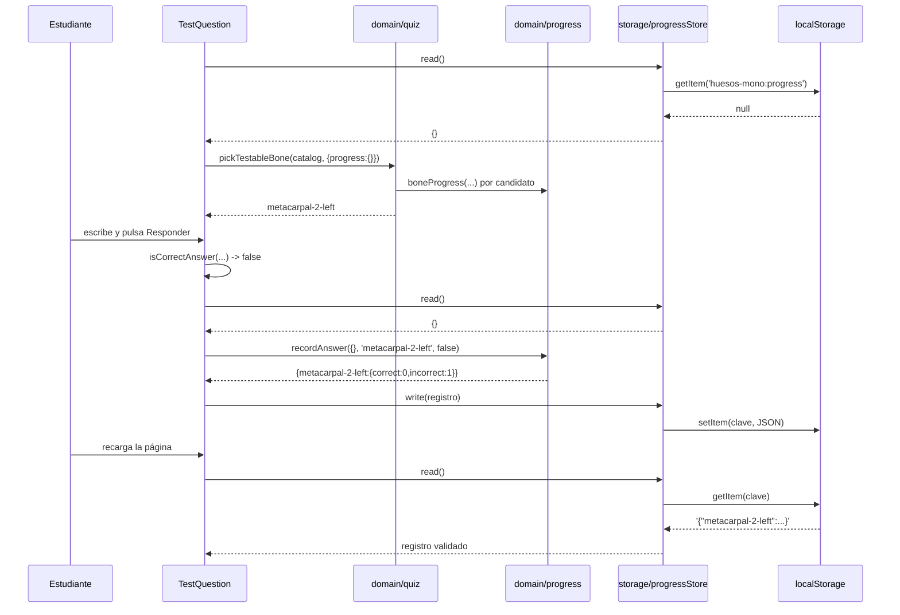

# Epic e5: Progreso y repaso dirigido — Docs

Cómo funciona el progreso persistente por hueso y el repaso dirigido: qué
ocurre cuando un estudiante responde, dónde engancharse para extenderlo, qué
tiene que seguir siendo cierto, y qué mirar cuando algo falla.

## Worked example

Un estudiante entra al modo test sobre hueso aislado, falla, y pasa a la
siguiente pregunta. Valores reales de una corrida verificada en Chromium.

**Estado de partida** — `localStorage['huesos-mono:progress']` no existe.

1. **Monta `BoneTestView`** → `<TestQuestion bones={catalog}
   store={progressStore} renderScene={…} />`.
2. **Primera pregunta.** `pickTestableBone(catalog, { progress: {} })`. Con el
   registro vacío, `weightFor` da `1` a los 199 huesos con `meshName`, así que
   el sorteo es uniforme. Sale **`metacarpal-2-left`**.
3. **La escena recibe solo el id.** `renderScene('metacarpal-2-left')` — el
   nombre no llega al DOM (`must-data-003`).
4. **El estudiante escribe** `"una respuesta que seguro no es"` y pulsa
   Responder.
5. **Veredicto.** `isCorrectAnswer('una respuesta que seguro no es', bone)` →
   `false`. La pantalla muestra `Incorrecto` y `segundo metacarpiano / os
   metacarpi II`.
6. **Se anota.** `store.write(recordAnswer(store.read(), 'metacarpal-2-left',
   false))`:
   - `store.read()` → `{}` (no hay clave guardada).
   - `recordAnswer({}, 'metacarpal-2-left', false)` →
     `{ "metacarpal-2-left": { correct: 0, incorrect: 1 } }`.
   - `store.write(…)` → `localStorage.setItem('huesos-mono:progress',
     '{"metacarpal-2-left":{"correct":0,"incorrect":1}}')`.
7. **Siguiente pregunta.** `pickTestableBone(catalog, { excluirId:
   'metacarpal-2-left', progress: store.read() })`. Ahora `metacarpal-2-left`
   pesaría `1 + 3×1 − 1×0 = 4`… pero está excluido por ser el inmediato
   anterior, así que no entra. Los demás siguen pesando 1.
8. **Recarga la página.** `store.read()` vuelve a leer la clave, valida su
   forma, y devuelve `{ "metacarpal-2-left": { correct: 0, incorrect: 1 } }`.
   **El progreso sobrevivió** — el observable de `RF-09`.

Dos preguntas más tarde, si vuelve a salir y a fallarse, su peso sube a `7` y
empieza a aparecer visiblemente más que el resto.



## Extension guide

E5 dejó **tres puntos de extensión**.

### 1 · Cambiar cómo se pondera (la regla de estudio)

En `src/domain/quiz.ts`:

```ts
const POR_FALLO = 3
const POR_ACIERTO = 1
const PESO_MINIMO = 1

export function weightFor(progress: ProgressRecord, boneId: string): number {
  const { correct, incorrect } = boneProgress(progress, boneId)
  return Math.max(PESO_MINIMO, PESO_MINIMO + POR_FALLO * incorrect - POR_ACIERTO * correct)
}
```

Ajustar `POR_FALLO` / `POR_ACIERTO` no rompe ninguna prueba: las pruebas fijan
el **orden** que produce la regla, no las cifras. Cambiar la **forma** de la
regla sí exige revisar `src/domain/quiz.test.ts`.

**Qué probar después:** que un hueso fallado siga saliendo más que uno no
fallado, y que un hueso muy acertado siga pudiendo salir (`weightFor` ≥ 1).

**Error a evitar:** quitar el `Math.max(PESO_MINIMO, …)`. No es una defensa: es
la invariante de ADR-005. Sin él, un hueso acertado seis veces tendría peso
negativo, desaparecería del sorteo, y la ponderación se convertiría en la cola
estricta que el ADR rechazó por encerrar el estudio.

### 2 · Persistir algo más (otro dato que sobreviva a la recarga)

`src/storage/progress-store.ts` es el molde: una interfaz mínima
(`KeyValueStorage`) que se **inyecta**, validación de forma al leer,
degradación a memoria al fallar. Copiar la estructura, no el archivo.

**Qué probar después:** las cuatro rutas de fallo —sin nada guardado, JSON
inválido, forma inesperada, almacén que lanza— más la ida y vuelta.

**Error a evitar:** crear la instancia dentro de un componente. La caché de
degradación es estado de la instancia; una por render la anula justo cuando
hace falta. Una instancia de módulo, pasada por props.

### 3 · Registrar más sobre una respuesta

El único sitio donde nace un veredicto es `responder()` en
`src/features/test/TestQuestion.tsx`. Instrumentar ahí cubre **las dos
variantes** de test (`RF-04` y `RF-05`) por construcción, porque ambas montan
este componente.

**Error a evitar:** añadir campos a `BoneProgress` sin la historia que los use.
Y si se añade uno, actualizar `esProgresoDeHueso` en el almacén — hoy el
validador re-codifica la forma a mano (aparcado en `records/parking-lot.md`).

## Data flow

Una sola tubería, en dos direcciones.

**Escritura** (al responder):

| Paso | Módulo | Entrada → Salida |
|------|--------|------------------|
| Veredicto | `domain/answer-check` | `(string, Bone)` → `boolean` |
| Anotación | `domain/progress` | `(ProgressRecord, string, boolean)` → `ProgressRecord` |
| Serialización | `storage/progress-store` | `ProgressRecord` → `string` (JSON) |
| Persistencia | `localStorage` | `string` bajo `'huesos-mono:progress'` |

**Lectura** (al elegir pregunta):

| Paso | Módulo | Entrada → Salida |
|------|--------|------------------|
| Recuperación | `localStorage` | clave → `string \| null` |
| Análisis y validación | `storage/progress-store` | `string` → `ProgressRecord` o `EMPTY_PROGRESS` |
| Ponderación | `domain/quiz` (`weightFor`) | `(ProgressRecord, string)` → `number` ≥ 1 |
| Sorteo | `domain/quiz` (`pickTestableBone`) | `(Bone[], PickOptions)` → `Bone` |

```mermaid
flowchart LR
    LS[(localStorage)] -->|string \| null| PS[storage/progress-store]
    PS -->|ProgressRecord validado| Q[domain/quiz]
    PS -->|ProgressRecord| TQ[features/test/TestQuestion]
    Q -->|Bone| TQ
    TQ -->|ProgressRecord| PS
    PS -->|JSON| LS
    P[domain/progress] -.->|recordAnswer, boneProgress| TQ
    P -.->|boneProgress| Q
```

La dependencia va siempre **almacenamiento → dominio**. `src/domain/` no
importa nada de `src/storage/`.

## Invariants & contracts

| Invariante | Síntoma al violarla | Cómo comprobarla |
|---|---|---|
| **El dominio no conoce el almacenamiento.** `src/domain/` no importa `src/storage/` | Un módulo puro deja de poder probarse sin navegador; el registro se vuelve inseparable de dónde vive | `grep -rn "storage" src/domain/` — solo debe salir un comentario, ningún `import` |
| **Un `id` ausente significa "nunca preguntado"**, no `undefined` | Errores de `undefined` en quien lee un hueso nuevo | `boneProgress({}, 'lo-que-sea')` → `{correct:0, incorrect:0}` |
| **`recordAnswer` no muta lo que recibe** | Re-renders perdidos; se guarda algo que nadie observó | `src/domain/progress.test.ts` — compara el registro de entrada antes y después |
| **El estado inicial no es un objeto compartido** | Corrupción global: mutar la lectura de un hueso cambia la de todos | `src/domain/progress.test.ts`, el test del objeto compartido |
| **Todo peso es ≥ 1** | Un hueso desaparece del sorteo; la ponderación se vuelve cola estricta (ADR-005) | `weightFor({x:{correct:999,incorrect:0}}, 'x')` → `1` |
| **Solo se preguntan huesos con `meshName !== null`** | Se pregunta por un hueso que no se puede resaltar ni aislar | `src/domain/quiz.test.ts`, 500 iteraciones |
| **El registro es plano y serializable** | Se pierden datos en la ida y vuelta por JSON | `src/domain/progress.test.ts`, ida y vuelta con los 206 ids reales |
| **Un fallo de almacenamiento degrada, no propaga** | El modo test entero se rompe en modo privado | `src/storage/progress-store.test.ts`, dobles que lanzan |
| **Nada sale a la red en tiempo de ejecución** (`must-privacy-006`) | El progreso del estudiante sale del navegador | `./scripts/check` — `tests/privacy.test.ts` y `tests/privacy-runtime.test.tsx` |
| **El almacén compartido es uno solo** | La degradación a memoria deja de funcionar | `progressStore` se crea a nivel de módulo, nunca dentro de un componente |

## Failure-mode catalog

**"El progreso no se guarda entre sesiones."**
*Causa raíz:* `localStorage` no disponible — modo privado, almacenamiento
bloqueado, cuota agotada. El adaptador degrada a memoria por diseño (ADR-004):
la sesión funciona, la recarga pierde el registro.
*Diagnóstico:* en la consola del navegador,
`localStorage.setItem('x','1')` — si lanza, es esto.
*Arreglo:* ninguno en el código; es el comportamiento decidido. Si empieza a
importar, ADR-004 lista la opción (D) que se rechazó y por qué.

**"El progreso se reinició solo."**
*Causa raíz:* el valor guardado no pasó la validación de forma y `read()`
devolvió `EMPTY_PROGRESS`. Ocurre si otra pestaña, la consola o una versión
anterior escribieron algo con otra forma. Se descarta el registro **entero** a
propósito: repararlo a medias produce un dato inventado con aspecto de real.
*Diagnóstico:* `localStorage.getItem('huesos-mono:progress')` y comprobar que
cada entrada tenga `correct` e `incorrect` enteros no negativos.
*Arreglo:* corregir o borrar la clave.

**"Siempre me pregunta lo mismo."**
*Causa raíz:* esperada si ese hueso acumula muchos fallos — el peso crece 3 por
fallo y **se refuerza dentro de la sesión** al seguir fallándolo (medido: 10 de
50 preguntas con 30 fallos sembrados).
*Diagnóstico:* leer el registro y calcular `1 + 3×incorrect − correct`.
*Arreglo:* acertarlo baja el peso 1 por acierto. Si aun así molesta, los pesos
son ajustables sin romper pruebas — ver *Extension guide*.

**"Un hueso nunca sale."**
*Causa raíz:* si tiene `meshName: null` es correcto — no puede resaltarse ni
aislarse, así que no puede preguntarse. Si tiene malla, es un defecto: revisar
que `weightFor` no devuelva 0 o negativo.
*Diagnóstico:* `catalog.find(b => b.id === '…')?.meshName`, y `weightFor`
directamente.

**"Un test del registro falla de forma rara tras tocar `boneProgress`."**
*Causa raíz:* devolver una constante de módulo como estado inicial. Es el
defecto que la review de e5.1 encontró: un objeto compartido para todo `id`
ausente convierte la mutación de un consumidor en corrupción global.
*Diagnóstico:* el test "el estado inicial que devuelve no es un objeto
compartido".
*Arreglo:* construir el valor en cada llamada, no sacarlo de una constante.

**"Cambié una firma y las pruebas siguen compilando, pero fallan."**
*Causa raíz:* la firma nueva es **más permisiva** que la vieja. Documentado en
la retrospectiva de e5.4: pasar de `(bones, excluirId?: string)` a
`(bones, opciones?: PickOptions)` con todo opcional dejó un test viejo pasando
un `string` donde va un objeto, sin error de tipos. El compilador protege al
hacer una firma más estricta, no al aflojarla.
*Diagnóstico:* `grep` por el nombre de la función y revisar cada llamada a
mano; no confiar en `tsc`.
*Arreglo:* migrar los llamadores. Y tratar el chequeo de tests huérfanos como
la red principal, no como trámite.

**"El gate de privacidad pasa pero no estoy seguro de que mire nada."**
*Causa raíz:* es el modo de fallo de toda comprobación cuyo caso feliz es una
lista vacía. Por eso cada una lleva su par: el recorrido afirma que encontró
más de 15 archivos con `App.tsx` entre ellos, y los espías afirman que
registran una llamada real.
*Diagnóstico:* introducir el defecto a propósito y ver el gate rojo. La salida
de esa demostración está copiada en el `progress.md` de e5.5.
