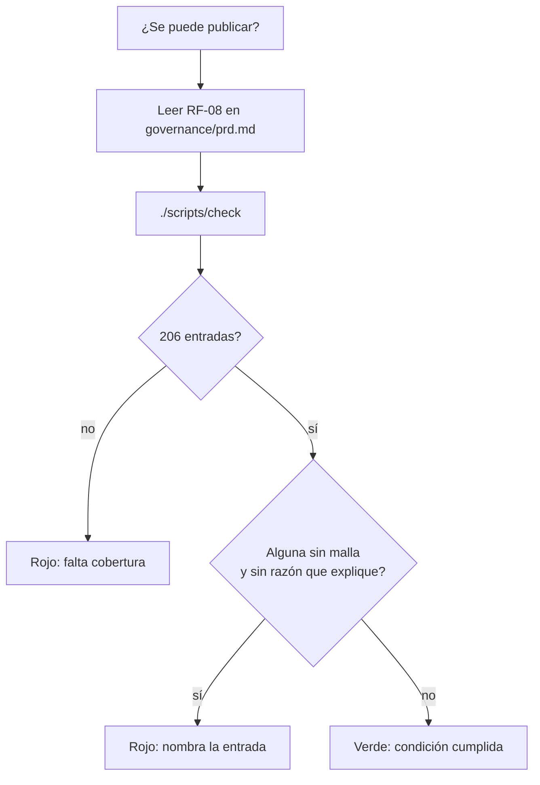

# Epic e6: Condición de lanzamiento — Docs

Qué significa "catálogo completo" en este proyecto, cómo se comprueba, y qué
pasa con los siete huesos que el modelo 3D no dibuja.

## Worked example

**Pregunta:** ¿se puede publicar huesos-mono? Se responde leyendo un párrafo y
corriendo un comando.

1. **Leer `RF-08`** en `governance/prd.md`. Dice que cada una de las 206
   entradas tiene región gráfica **o bien** una razón documentada, que
   *completo* se refiere a la cobertura del catálogo y no a la del modelo, y
   nombra la prueba que lo verifica.
2. **Correr `./scripts/check`.** La prueba
   `cumple la condición de lanzamiento: geometría o razón, nunca ninguna`
   recorre las 206 entradas y recoge las que no cumplen.
3. **Con el catálogo actual**, la lista de incumplidoras es `[]` y la longitud
   es 206 → verde → **se puede publicar**.

Traza real de la única entrada que estuvo cerca de no cumplir, durante la
demostración del gate:

| Paso | Valor |
|---|---|
| Entrada | `hyoid` |
| `meshName` | `null` — el modelo no lo dibuja |
| `missingReason` | `"No articula con ningún otro hueso —queda suspendido en el cuello por músculos y ligamentos— y el modelo del esqueleto no lo incluye."` (139 caracteres) |
| Filtro de la prueba | `meshName === null && (missingReason?.length ?? 0) <= 20` → `139 <= 20` es falso |
| Resultado | **no** entra en la lista de incumplidoras → cumple |

Y con la razón puesta en `'n/a'` (3 caracteres):

```
AssertionError: entradas sin geometría y sin una razón que explique:
  expected [ 'hyoid' ] to deeply equal []
```



## Extension guide

### Añadir un hueso al catálogo

`src/data/catalog.ts`. El tipo `Bone` hace **imposible** el estado incoherente:
o se da `meshName: string` sin `missingReason`, o `meshName: null` **con**
`missingReason`. El compilador lo exige; la prueba de la condición de
lanzamiento exige además que la razón **explique** (más de 20 caracteres).

**Qué probar después:** `./scripts/check`. Si la entrada rompe el desglose
canónico por región, fallará `reparte los huesos por región…`, y esa cifra se
cambia solo con una razón anatómica, no para que pase la prueba.

**Error a evitar:** una razón simbólica (`"n/a"`, `"-"`, `"pendiente"`). Cumple
la letra del tipo y no el propósito del requisito; la prueba la rechaza.

### Si algún día se consigue la geometría de los siete

Es la alternativa (A) de ADR-006, diferida y **no** rechazada. El cambio de
datos es de una línea por hueso: `meshName: null` + `missingReason` pasan a
`meshName: '<nombre de malla>'`. Después hay que:

1. Actualizar los recuentos `ancla 199 entradas` y `declara exactamente 7
   ausencias` en `src/data/catalog.coverage.test.ts` — están ahí justamente
   para delatar este cambio.
2. Revisar `AusenciaEnElModelo` en `BoneDetailView.tsx`: si dejan de existir
   huesos sin malla, ese componente queda huérfano.
3. Reescribir `RF-08`, que volvería a poder exigir región gráfica a todas.

### Cambiar qué significa "completo"

Va por ADR: ADR-006 no se edita, se supersede. `RF-08` lo cita, así que el
requisito y su porqué se mueven juntos.

## Data flow

No hay tubería de ejecución: esta épica es de gobernanza y de verificación. El
flujo es de **afirmaciones**, y cada una vive en un sitio y solo en uno.

| Afirmación | Dónde vive | Quién la consume |
|---|---|---|
| Una entrada tiene malla **o** razón, nunca ambas ni ninguna | tipo `Bone` (`src/data/bone.ts`), unión `MappedBone \| UnmappedBone` | El compilador, al escribir el catálogo |
| Ninguna entrada queda sin malla y sin una razón que **explique** | `catalog.coverage.test.ts`, prueba de la condición de lanzamiento | `./scripts/check`, y `RF-08` que la cita |
| El modelo ancla 199 entradas · hay 7 ausencias | `catalog.coverage.test.ts`, dos recuentos | Detector de cambios silenciosos en el activo |
| Una entrada con malla no lleva razón de ausencia | `catalog.test.ts`, la conversa | `./scripts/check` |
| Qué significa "completo" y por qué | ADR-006, citado desde `RF-08` | Quien decide si se publica |

```mermaid
flowchart LR
    ADR[ADR-006<br/>qué significa completo] --> RF[RF-08<br/>governance/prd.md]
    RF -->|cita por nombre| T[catalog.coverage.test.ts<br/>condición de lanzamiento]
    T -->|recorre| C[(src/data/catalog.ts<br/>206 entradas)]
    B[tipo Bone<br/>MappedBone | UnmappedBone] -->|impide al escribir| C
    T --> G[./scripts/check]
```

## Invariants & contracts

| Invariante | Síntoma al violarla | Cómo comprobarla |
|---|---|---|
| **206 entradas, ni una más ni una menos** | El desglose canónico deja de cuadrar | `tiene los 206 huesos del esqueleto adulto` |
| **Toda entrada sin malla trae una razón que explica (>20 caracteres)** | La condición de lanzamiento se cumple de mentira, con una razón simbólica | `cumple la condición de lanzamiento…` — nombra la entrada infractora |
| **Una entrada con malla nunca trae razón de ausencia** | Un hueso visible dice que no se puede señalar | `no deja razón de ausencia a una entrada que sí tiene geometría` |
| **El catálogo cubre anatomía, no el activo** | Se quitan entradas para que las cuentas cierren | El recuento de 206 y el reparto por región; ADR-006 lo prohíbe explícitamente |
| **Cada afirmación vive en un solo sitio** | Se cambia una regla y otra prueba sigue afirmando lo viejo | Romper el dato: tiene que fallar **exactamente una** prueba |
| **Ninguna superficie anuncia una vista 3D inexistente** | Un lector de pantalla oye "aislado en 3D" sobre un lienzo vacío | `BoneDetailView.test.tsx`, "no anuncia una vista tridimensional que no existe" |

## Failure-mode catalog

**"La prueba de la condición de lanzamiento falla y no sé qué entrada."**
*Causa raíz:* una entrada quedó sin malla y sin razón que explique.
*Diagnóstico:* el mensaje de la aserción **nombra el id** — `expected [ 'hyoid' ]
to deeply equal []`.
*Arreglo:* darle una razón que explique de verdad, o anclarla a su malla.

**"Añadí un hueso y falla el reparto por región."**
*Causa raíz:* `CANON` en `catalog.coverage.test.ts` fija cuántos huesos tiene
cada región según el desglose canónico del proyecto (sacro y cóccix uno cada
uno; el esternón uno pese a que el modelo lo parta).
*Diagnóstico:* el mensaje dice la región y las dos cifras.
*Arreglo:* si el hueso está bien, corregir `CANON` **con una razón anatómica**.
Nunca para que la prueba pase.

**"El panel 3D de una ficha está negro y no hay ningún error."**
*Causa raíz:* el hueso no tiene geometría. `IsolatedBoneScene` no encuentra
malla visible, no monta cámara, y **no lanza nada**: degradación silenciosa.
Era un defecto real hasta e6.1 — el panel además anunciaba "aislado en 3D".
*Diagnóstico:* `catalog.find(b => b.id === '…')?.meshName === null`.
*Arreglo:* ya está: `BoneDetailView` monta la explicación en vez de la escena.
Si vuelve a aparecer, es que alguien montó `IsolatedBoneScene` sin comprobar la
malla. **La lección, de la retrospectiva de e6.1:** la degradación elegante de
un componente y la honestidad de la pantalla son cosas distintas, y la primera
esconde la falta de la segunda.

**"Cambié una regla del catálogo y otra prueba sigue afirmando lo viejo."**
*Causa raíz:* la misma invariante afirmada en dos sitios sin referencias
cruzadas. Pasó dos veces en esta épica, una de ellas cruzando archivos
(`catalog.test.ts` repetía lo de `catalog.coverage.test.ts`).
*Diagnóstico:* **romper el dato a propósito y contar cuántas pruebas fallan.**
Si falla más de una, hay una afirmación repetida.
*Arreglo:* dejar una que afirme y que las demás digan otra cosa o la citen.

**"El PRD dice una cosa y las pruebas otra."**
*Causa raíz:* el requisito y su gate se escribieron en momentos distintos y
nadie los comparó. Es el defecto que originó esta épica entera: `RF-08` exigía
geometría a las 206 desde antes de que E1 decidiera no cubrir siete.
*Diagnóstico:* imprimir el observable del PRD y la lista de `it(...)` juntos y
leerlos en paralelo — un comando. **Es una comparación, no una lectura.**
*Arreglo:* alinear el que esté equivocado, y hacer que el requisito **cite la
prueba por su nombre** para que la próxima desalineación sea visible desde
cualquiera de los dos.
