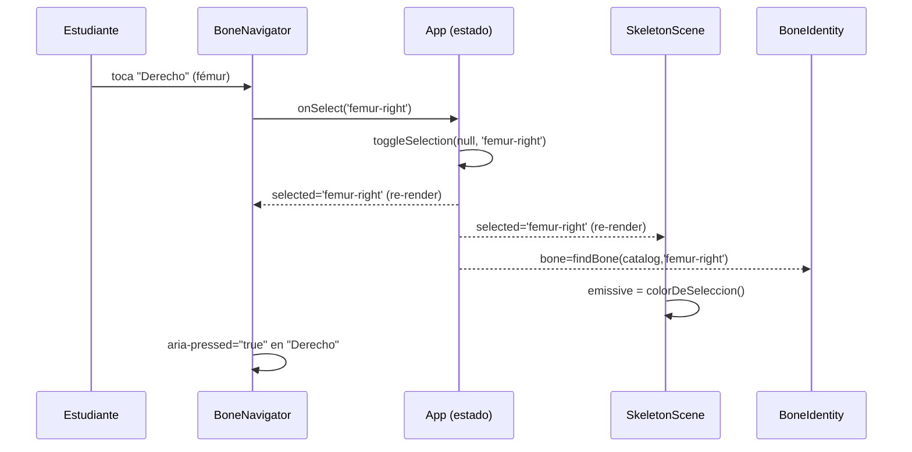
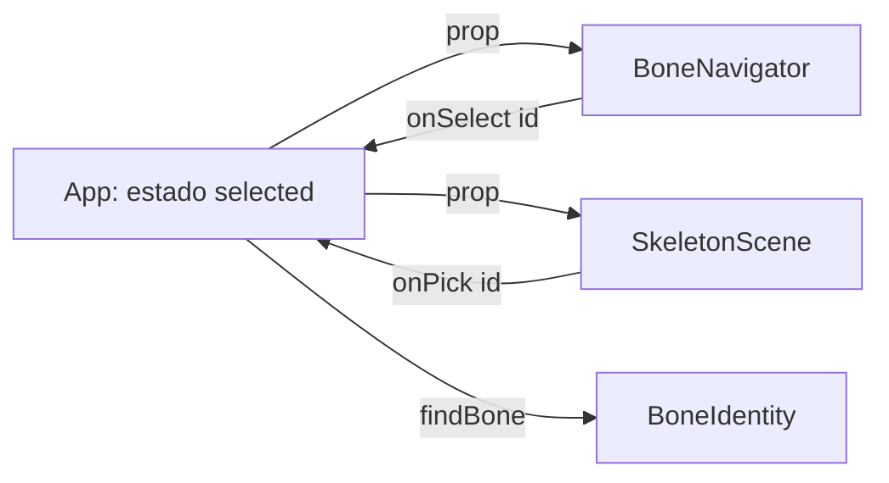

# Epic E7: Mobile-first redesign — Docs

> Provisional — revise once a real run under this skill shows what the
> shape should actually be; do not treat this as a settled contract.

## Worked example

Elegir "fémur derecho" desde el navegador de huesos en Explorar, a
390×844 (móvil):

1. El estudiante toca la píldora "Derecho" en la fila del par "fémur"
   dentro de `BoneNavigator` (`src/components/BoneNavigator.tsx:118-130`).
   El botón dispara `onClick={() => onSelect(bone.id)}` con
   `bone.id = 'femur-right'`.
2. `ExploreView` (`src/features/explore/ExploreView.tsx:31`) pasa ese
   `onSelect` tal cual desde sus props — no lo intercepta.
3. `App` (`src/App.tsx:112-115`) es quien lo posee de verdad:
   `onSelect={(id) => setSelected((actual) => toggleSelection(actual, id))}`.
   `toggleSelection(null, 'femur-right')` devuelve `'femur-right'`
   (`src/domain/selection.ts`).
4. React vuelve a renderizar `App` → `ExploreView` con
   `selected = 'femur-right'`. En el mismo commit:
   - `BoneNavigator` marca `aria-pressed="true"` en el botón de "Derecho" y
     `aria-pressed="false"` en cualquier otro que lo tuviera.
   - `SkeletonScene` → `SkeletonHalf` (`src/components/SkeletonScene.tsx:52-71`)
     recorre las mallas del modelo en un `useLayoutEffect`: para la malla
     `femur` en la mitad `original`, `boneIdForMesh` resuelve `'femur-right'`,
     coincide con `selected`, y le asigna `emissive = colorDeSeleccion()`
     (el valor vivo de `--color-acento`, `#2f5fe0`) con
     `emissiveIntensity = 0.6`.
   - `BoneIdentity` (`src/components/BoneIdentity.tsx`) recibe el `Bone`
     resuelto por `findBone(catalog, 'femur-right')` y renderiza "Fémur" /
     "os femoris" / región "Miembro inferior" / lado "Derecho" dentro de la
     tarjeta flotante de `ExploreView`.
5. Medido bajo CPU 4x (e7.10, `e2e/perf-selection.spec.ts`): el paso 4
   completo —clic hasta `aria-pressed="true"`— tarda una mediana de 4,8ms,
   máximo 15,2ms sobre una muestra de 20 selecciones.

## Extension guide

**Agregar un nuevo breakpoint `md:` a una vista que se estira sin límite**
(el patrón que e7.9 estableció, ya extendido tres veces):

1. Confirmar el problema con una captura real de Playwright a 1400×900
   (`test.use` no hace falta — es el viewport por defecto del proyecto),
   igual que `e2e/desktop-scale-up.spec.ts` lo hace.
2. Escribir el RED: una aserción de `boundingBox().width` sobre el
   contenedor real que se estira (no sobre un `` con `flex-1` — ver
   "Invariantes" más abajo), con un umbral concreto entre el valor roto y
   el valor esperado.
3. GREEN: una clase `md:max-w-*` (o `md:mx-auto md:max-w-*` para centrar)
   en el contenedor — nunca en los hijos individuales.
4. Correr `e2e/mobile-shell.spec.ts` completo además del spec nuevo: es la
   regresión que confirma que 390×844 no cambió.

**Agregar un token nuevo a `@theme`** (`src/index.css`): seguir el patrón
ya usado — nombre semántico (`--color-{uso}`, no `--color-{tono}`),
comentario con el contraste WCAG calculado si es un color de texto. Un
componente de tres.js que necesite ese color debe leerlo con
`getComputedStyle(document.documentElement).getPropertyValue('--color-{nombre}')`
en tiempo de render (ver `colorDeSeleccion` en `SkeletonScene.tsx:20-27`) —
nunca como constante de módulo con un hex propio.

**Error común:** escribir el RED de un test de ancho midiendo el
`` de texto en vez de su contenedor — ver "Invariantes" abajo.

## Data flow

- **Estado:** `selected: SelectionId` vive en `App` (`src/App.tsx:101`),
  nunca en `ExploreView` — sobrevive a un viaje a la ficha completa y
  vuelta, que es justo lo que un componente desmontado no podría hacer
  (ver "propiedad del estado sigue a la supervivencia" en `App.tsx`'s
  propio comentario).
- **Filas del navegador:** `Bone[]` → `groupByRegion` (`src/domain/regions.ts`)
  → `toNavigatorRows` (`src/domain/navigator-rows.ts:35`) → `NavigatorRow[]`
  (`{kind:'paired', right, left}` | `{kind:'single', bone}`), consumido por
  `BoneNavigator.tsx` para decidir fila-con-nombre-y-dos-píldoras vs.
  fila-simple vs. fila-colapsada (ambos lados sin malla).
- **Emparejamiento de lados:** `siblingId`/`isSideIrrelevant`
  (`src/domain/side-pairing.ts`) — puros, sin React, consumidos por
  `navigator-rows.ts` (agrupar filas) y `BoneIdentity.tsx` (ocultar el
  campo "Lado" cuando ningún lado tiene malla).
- **Latencia:** medida enteramente dentro del navegador
  (`e2e/perf-selection.spec.ts`) — `performance.now()` antes del
  `dispatchEvent('click')`, un `MutationObserver` sobre `aria-pressed` del
  mismo botón resuelve la promesa. Ningún viaje de ida y vuelta de
  Playwright entra en la medición.

## Invariants & contracts

- **`must-a11y-005` — dos vías equivalentes a toda selección** (ADR-002):
  clic en la escena y clic en `BoneNavigator` llaman al mismo `onSelect`.
  Síntoma de violación: un test de `ExploreView.test.tsx` que solo puede
  seleccionar por una vía. Se comprueba con
  `npx vitest run src/features/explore/ExploreView.test.tsx`.
- **El navegador nunca se desmonta en Explorar** (ADR-010): sigue montado
  `sr-only` en móvil, `not-sr-only` desde `md:` — nunca condicional a la
  selección ni al modo. Síntoma de violación: `e2e/explore.spec.ts` (b2.1,
  b2.3) falla al no encontrar un botón por nombre accesible.
- **Ningún color escrito a mano** — todo color vive en `--{token}` de
  `@theme`, incluidos los de `three.js` (resueltos en tiempo de render, no
  como constante). Se comprueba con
  `grep -rnE "#[0-9a-fA-F]{3,6}" src/components src/features` — cualquier
  resultado fuera de un archivo `.test.tsx` es una violación (hallazgo
  cerrado en epic-review: `SkeletonScene.tsx`, `fix(scene): read the
  selection highlight from the design token`).
- **Todo objetivo interactivo ≥44×44px** (ADR-007) — se comprueba con
  `e2e/mobile-shell.spec.ts` ("todo objetivo del shell se puede pulsar con
  el pulgar" y las pruebas por vista).
- **`sr-only` no comprime el layout interno** — un elemento `sr-only`
  conserva su posición real en el documento, solo se recorta
  visualmente. `.click({force:true})` de Playwright clickea esa posición
  real, casi siempre fuera del viewport, y no dispara nada.
  `.dispatchEvent('click')` sí, porque no depende de la posición.

## Failure-mode catalog

**Síntoma: un test de Playwright mide un "vacío" pequeño donde a simple
vista hay uno enorme.**
Causa raíz: se midió el `boundingBox()` de un `` con `flex-1` que
contiene texto alineado a la izquierda — la caja del span ya creció para
llenar el espacio disponible; el texto queda pegado a su borde izquierdo,
lejos del borde derecho de esa misma caja. Diagnóstico: medir el
`boundingBox()` del contenedor ancestro real (la `<li>`/fila), no del
`` de texto. Ejemplo real: `e2e/desktop-scale-up.spec.ts`, test de
Fichas — medir el nombre del par daba 8px de distancia; medir la fila daba
1264px, el número real.

**Síntoma: `touch-action: none` funciona al cargar pero deja de aplicarse
unos cientos de milisegundos después, y el gesto de pellizco hace zoom en
la página en vez de en la escena.**
Causa raíz: `OrbitControls` de `three-stdlib` desconecta y reconecta sus
listeners después del montaje (verificado: 217-286ms, coincide con la
carga del modelo), y cada reconexión reescribe el estilo en línea del
`<canvas>`. Diagnóstico: inyectar un `MutationObserver` sobre
`style` del canvas y loguear cada cambio. Fix: `FixTouchAction`
(`src/components/SkeletonScene.tsx:158-171`) — un watchdog que reaplica
`touch-action: none` cada vez que el estilo cambia, sin depender de
adivinar el momento exacto.

**Síntoma: un clic real sobre el `<canvas>` en la suite de Playwright
tarda ~2 segundos.**
Causa raíz: renderizado por software (sin GPU) en el entorno de ejecución
— no es un problema de la aplicación. Diagnóstico: cualquier medición de
rendimiento que dependa de clics directos sobre el lienzo va a reportar
ese costo del entorno, no el de la app. Fix/mitigación: medir por una vía
que dispare el mismo cambio de estado sin pasar por el raycasting de
three.js — en e7.10, el navegador de huesos (mismo `onSelect`, mismo
commit de React).

**Síntoma: `should-perf-007` (u otro guardrail con una cifra concreta)
parece contradecir una decisión ya aceptada del proyecto.**
Causa raíz: el guardrail puede seguir describiendo una **opción que un ADR
comparó y rechazó**, no la que aceptó — nada compara automáticamente el
texto de gobernanza contra las opciones de un ADR, solo contra si el ADR
sigue vigente. Diagnóstico: releer la sección "Options" del ADR citado,
no solo su título/estado. Ejemplo real: `should-perf-007` exigía "SVG
< 500KB"; ADR-001 había comparado un SVG de 304KB contra el modelo glTF y
**adoptó el glTF** por cobertura (206 huesos vs. 43 regiones agrupadas).

**Síntoma: un `<canvas>` recién montado mide 300×150 en vez de ocupar su
contenedor.**
Causa raíz: las dimensiones intrínsecas de HTML para `<canvas>` sin
tamaño explícito son 300×150, y el layout real (CSS/flex/grid) tarda un
frame en aplicarse. Diagnóstico/fix: esperar con `expect.poll` a que
`boundingBox()` supere esas dimensiones antes de medir o interactuar —
ver `esperarLienzoDimensionado` en `e2e/explore.spec.ts` y
`e2e/desktop-scale-up.spec.ts`.
