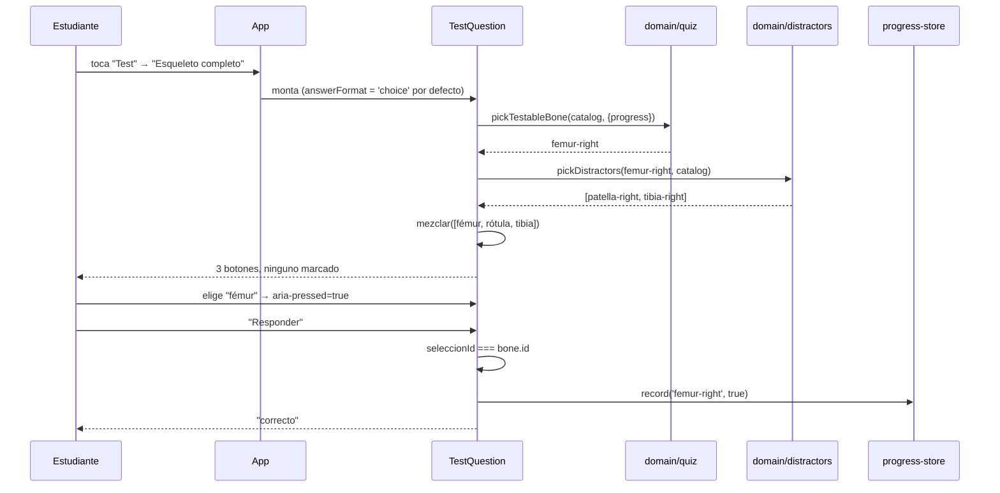
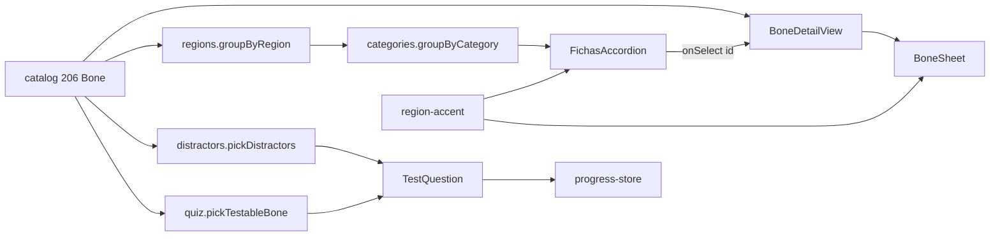

# Epic e8: Redesign mockup follow-ups — Docs

> Provisional — revise once a real run under this skill shows what the
> shape should actually be; do not treat this as a settled contract.

## Worked example

Responder una pregunta del test de esqueleto completo sobre `femur-right`,
con el sorteo fijado en `() => 0` para que los valores sean reproducibles
(el sorteo real es `Math.random`):

1. El estudiante toca "Test" y luego "Esqueleto completo". `App`
   (`src/App.tsx`) pasa de `{ tipo: 'test-elegir' }` a
   `{ tipo: 'test-esqueleto' }` y monta `SkeletonTestView`
   (`src/features/test/SkeletonTestView.tsx`), que delega en `TestQuestion`
   con `renderScene` propio y `answerFormat` sin pasar → **`'choice'` por
   defecto** (ADR-012).
2. `pickTestableBone(catalog, { progress: store.read() })`
   (`src/domain/quiz.ts`, sin tocar en esta épica) devuelve el hueso
   preguntado. Para el ejemplo: `femur-right` — `es: 'fémur'`,
   `region: 'lower-limb'`, `meshName: 'Femur.r'`.
3. `pickDistractors(bone, catalog, { sorteo: () => 0 })`
   (`src/domain/distractors.ts`):
   - Filtra preguntables: `meshName !== null`, quita `femur-right` y quita
     su hermano `femur-left` (`siblingId`).
   - Parte en `misRegion` (`region === 'lower-limb'`, 60 huesos con malla) y
     `resto`.
   - Extrae el primero de `misRegion` → **`patella-right`** (`'rótula'`), y
     acto seguido quita `patella-left` de los candidatos para que dos
     hermanos no compitan.
   - Extrae de nuevo → **`tibia-right`** (`'tibia'`), y quita `tibia-left`.
   - Devuelve `[rótula, tibia]`.
4. `mezclar([bone, ...distractores])` (`src/features/test/TestQuestion.tsx`)
   produce las 3 opciones en orden aleatorio: `fémur`, `rótula`, `tibia`.
5. Render: tres `<button aria-pressed="false">` dentro de un
   `role="group"` etiquetado "¿qué hueso es?", **ninguno marcado como
   correcto en el DOM** (`must-data-010`), y "Responder" deshabilitado hasta
   que haya selección. La escena resalta el hueso preguntado y su
   `accessibleHint` dice "Un hueso está señalado en el esqueleto. Elegí su
   nombre entre las 3 opciones."
6. El estudiante toca "fémur" → `setSeleccionId('femur-right')` →
   `aria-pressed="true"` solo en ese botón.
7. "Responder" compara **por id exacto**, no por texto:
   `seleccionId === bone.id` → acierto. `store.record('femur-right', true)`
   persiste el resultado (`src/storage/progress-store.ts`, ADR-005 sin
   tocar), y la vista pasa a `resultado: 'correcto'`.



## Extension guide

Esta épica dejó tres puntos de extensión.

**1 · Un campo de contenido nuevo en la ficha completa**

Los campos `articulatesWith` y `clinicalNote` (e8.5) son el patrón: contenido
redactado, opcional, presente solo donde alguien lo verificó.

- Declararlo en `BoneCore` (`src/data/bone.ts`) como opcional, con un
  comentario que diga por qué falta en la mayoría de las entradas.
- Rellenarlo en `src/data/catalog.ts` **en ambos lados del par** — el dato es
  del hueso, no del lado.
- Renderizarlo en `src/features/bone-detail/BoneSheet.tsx` dentro del `<dl>`,
  con el componente `Fila` y renderizado condicional:
  ```tsx
  {bone.nuevoCampo && <Fila etiqueta="Etiqueta">{bone.nuevoCampo}</Fila>}
  ```
- Testear en `BoneSheet.test.tsx` los **dos** casos: presente y ausente. El
  test del ausente debe empezar afirmando que el fixture no lo tiene
  (`expect(parietal.nuevoCampo).toBeUndefined()`), o pasa por accidente.
- **Error común:** meter el campo en `BoneIdentity` también. El panel de
  Explorar es otra presentación con otras restricciones de espacio; ver la
  entrada del parking lot del 2026-08-17 sobre las dos presentaciones.

**2 · Otro criterio de plausibilidad para los distractores**

`pickDistractors` (`src/domain/distractors.ts`) es dominio puro con sorteo
inyectable. Para cambiar el criterio (por ejemplo, "misma categoría" en vez de
"misma región"), se toca solo la partición `misRegion`/`resto`; el bucle de
extracción y la exclusión de hermanos no cambian.

- Testear con `sorteo` determinista, nunca con `Math.random`.
- Elegir fixtures que **estresen** la regla: una región chica y pareada
  (`pelvic-girdle`, 2 huesos) atrapa lo que `lower-limb` (60) esconde.
- **Error común:** olvidar que el guard `preguntables.length < count` solo se
  ejercita con `count` distinto de 2 (ver parking lot, e8.3).

**3 · Una categoría o subgrupo nuevo en Fichas**

`groupByCategory` (`src/components/categories.ts`) deriva la categoría del
prefijo de `REGION_LABEL` antes del guion largo: `'Cráneo — cara'` → `'Cráneo'`.
No hay lista de categorías que mantener — se agregan cambiando la etiqueta.

- Fusiona solo regiones **adyacentes** en el orden de `groupByRegion`; una
  región que comparta prefijo pero quede lejos abre su propia categoría.
- El color de la categoría lo da su **primera** región vía `REGION_ACCENT`.
- **Error común:** poner este módulo en `src/domain/`. Depende de
  `REGION_LABEL`, que es traducción de la capa de vista.

## Data flow

**Pipeline del test por opción múltiple** (e8.3 + e8.4)

```
catalog: readonly Bone[]
  → pickTestableBone(catalog, {progress})        [src/domain/quiz.ts]
  → Bone                                          (el hueso preguntado)
  → pickDistractors(bone, catalog, {count?, sorteo?})  [src/domain/distractors.ts]
  → Bone[]                                        (2 por defecto, misma región primero)
  → mezclar([bone, ...distractores])              [TestQuestion.tsx]
  → Bone[3]                                       (orden aleatorio)
  → render: 3 <button aria-pressed>                (ninguno marcado)
  → seleccionId: string | null
  → seleccionId === bone.id                       (comparación por id, no por texto)
  → progressStore.record(id, acierto)             [src/storage/progress-store.ts]
```

**Pipeline de Fichas** (e8.2)

```
catalog: readonly Bone[]
  → groupByRegion(bones)      [src/domain/regions.ts]     → RegionGroup[]  (10)
  → groupByCategory(grupos)   [src/components/categories.ts] → CategoryGroup[] (9)
  → toNavigatorRows(bones)    [src/domain/navigator-rows.ts] → NavigatorRow[]
  → grilla de <button>        [src/components/FichasAccordion.tsx]
```

Las 9 categorías reales, con su total: Cráneo (22, subgrupos `cranium` +
`face`), Oído medio (6), Hioides (1), Columna vertebral (26), Tórax (25),
Cintura escapular (4), Miembro superior (60), Cintura pélvica (2), Miembro
inferior (60).

**Pipeline de la ficha completa** (e3.2, reconstruida en e8.5)

```
boneId: string
  → findBone(catalog, boneId)   [src/domain/selection.ts]  → Bone | undefined
  → BoneDetailView                                          [features/bone-detail/]
     ├─ bone.meshName === null → <AusenciaEnElModelo />     (no monta lienzo)
     └─ si no                  → <IsolatedBoneScene />
  → BoneSheet(bone)
     + REGION_ACCENT[bone.region]  [src/components/region-accent.ts] → {bg, text}
     + REGION_LABEL / SIDE_LABEL   [src/components/labels.ts]
     + isSideIrrelevant(bone, catalog) [src/domain/side-pairing.ts] → oculta "Lado"
```



## Invariants & contracts

| Debe ser cierto | Síntoma si se viola | Cómo comprobarlo |
|---|---|---|
| `must-data-010`: ninguna de las 3 opciones llega marcada como correcta en el DOM antes de responder | Un `aria-pressed="true"`, un `data-*` o un orden fijo delatan la respuesta; el test deja de medir conocimiento | `./scripts/check` — `SkeletonTestView.test.tsx` y `BoneTestView.test.tsx` tienen el caso con ese nombre |
| `must-data-003`: el formato escrito sigue validando con tolerancia (español/latín, tildes, artículos, sinónimos) | Nadie lo nota: no hay puerta de entrada en la interfaz. Se descubre cuando una épica futura lo reabra y ya no funcione | `TestQuestion.test.tsx`, casos con `answerFormat="open"` |
| `pickDistractors` nunca devuelve el hermano del hueso preguntado, ni dos hermanos entre sí | Dos botones con **el mismo texto** — el `es` no lleva el lado | `distractors.test.ts`; verificable a ojo en el test de una región pareada |
| `pickDistractors` devuelve siempre exactamente `count` | El grupo de opciones queda con menos de 3 botones | Lanza si el catálogo no alcanza, no devuelve de menos |
| ADR-011: `FichasAccordion` no toca `BoneNavigator` | La vía accesible de Explorar (ADR-002/ADR-010) se rompe al cambiar Fichas | `BoneNavigator.tsx` no aparece en el diff de e8.2; la duplicación de `accessibleName` es el costo aceptado |
| `articulatesWith` / `clinicalNote` son opcionales: sin dato, **no hay fila** | Una etiqueta rotulando un vacío en 202 de 206 fichas | `BoneSheet.test.tsx`, caso `parietal-right` |
| Un hueso sin `meshName` no monta lienzo y explica su ausencia | Panel negro junto a texto correcto: parece la aplicación rota | `BoneDetailView.test.tsx`, casos de `malleus-right` |
| Todo control interactivo mide ≥ 44 px | Imposible de tocar con el pulgar en un teléfono real | `e2e/mobile-shell.spec.ts` |
| `should-perf-007`: latencia de selección bajo CPU limitada 4x dentro del techo | La selección "se siente pegajosa" en un teléfono de gama baja | `./scripts/check-integration` — `perf-selection.spec.ts` (mediana medida al cierre: 4.7 ms) |
| `must-privacy-006`: ninguna petición de red en tiempo de ejecución | La aplicación deja de funcionar sin conexión | `tests/privacy.test.ts` y `tests/privacy-runtime.test.tsx` |

## Failure-mode catalog

**1 · «Los clics en el esqueleto dejaron de seleccionar huesos»** *(e8.5)*

- **Causa raíz:** un elemento con `position: absolute` sobre el lienzo 3D
  intercepta el evento antes del raycasting. Pasó al flotar la cabecera sobre
  `ExploreView`.
- **Diagnóstico:** una grilla de clics sobre el lienzo, contando huesos
  distintos alcanzados. Con la cabecera en flujo normal: 8 de 12x12. Con la
  cabecera flotante: 1.
- **Arreglo:** cabecera en el flujo del documento, con margen simétrico. Si un
  elemento **tiene** que flotar sobre el lienzo, acotarlo a una zona donde no
  haya geometría clicable (como la tarjeta de identidad, que va abajo).

**2 · «El test pasa en jsdom y falla en el navegador» (o al revés)** *(e8.1)*

- **Causa raíz:** jsdom sobrecomputa roles de landmark. `getByRole('banner')`
  encuentra un `<header>` anidado en `<main>` que un navegador real ya no
  expone así.
- **Diagnóstico:** si un test de rol pasa en `vitest` y su equivalente falla
  en Playwright, sospechar del rol implícito antes que del componente.
- **Arreglo:** anclar la consulta a algo que ambos entornos vean igual — acá,
  `data-testid="cabecera"`.

**3 · «Un e2e de una épica vieja se rompe sin que nadie toque su código»**
*(epic-review de E8)*

- **Causa raíz:** el test codificaba el **medio** y no el fin. `el lienzo de
  Explorar ocupa toda la pantalla disponible` medía desde el borde inferior
  del `<nav>`; e8.5 metió 12 px de aire deliberado bajo la navbar y el
  criterio pasó a contar ese margen como espacio desperdiciado.
- **Diagnóstico:** medir la geometría real antes de tocar nada
  (`getBoundingClientRect` de cabecera, nav y canvas). Si el hueco coincide
  exacto con un margen intencional, es el test el que envejeció.
- **Arreglo:** medir desde la cabecera **con su margen**. Y comprobar que el
  instrumento sigue pudiendo fallar: al meter un hueco muerto de 40 px, el
  test vuelve a rojo.

**4 · «El texto está en el DOM pero no se ve»** *(e8.5)*

- **Causa raíz:** un componente dibujado sobre una superficie de otro tema
  conserva las clases de color del original. `text-tinta` (#17150f) sobre
  `--color-lienzo` (#20242b) es ilegible; vivió así desde e7.2.
- **Diagnóstico:** capturar **el caso concreto** en un navegador. Ningún test
  unitario lo ve: el texto sigue estando y el gate de tokens no mira
  contraste.
- **Arreglo:** color explícito contra la superficie real (`text-panel` sobre
  el lienzo). Al planear la verificación visual, listar los estados
  excepcionales — este apareció solo en la ficha de un hueso **sin**
  geometría.

**5 · «Dos opciones del test dicen lo mismo»** *(e8.3)*

- **Causa raíz:** `bone.es` no lleva el lado (`clavicle-right` y
  `clavicle-left` comparten `'clavícula'`), así que dos hermanos como
  distractores se renderizan idénticos.
- **Diagnóstico:** mirar el grupo de opciones de un hueso de una región
  pareada; si dos botones repiten texto, el sorteo eligió hermanos.
- **Arreglo:** `pickDistractors` quita el hermano del elegido tras cada
  extracción. Ya está; lo que hay que preservar es el test que lo cubre.

**6 · «Un color nuevo entró sin pasar por el sistema de diseño»**
*(epic-review de E7 y E8)*

- **Causa raíz:** `design-tokens.test.ts` vigila la **paleta de fábrica de
  Tailwind**, no la regla de ADR-007. Un hexadecimal en un módulo TypeScript
  aplicado con `style={{}}` pasa limpio — así entraron los 23 valores de
  `REGION_ACCENT` y `ACENTO_PESTANIA`.
- **Diagnóstico:** `grep -rn "#[0-9a-f]\{6\}" src/ --include='*.ts*'` — todo
  lo que aparezca fuera de `index.css` está fuera del gate.
- **Arreglo:** aparcado, con dos caminos en `records/parking-lot.md`
  (2026-08-17). Mientras tanto, cualquier color nuevo se agrega **junto** a
  los existentes en `region-accent.ts`, nunca suelto en un componente.

**7 · «La suite de integración mide un build viejo»** *(E7, sigue vigente)*

- **Causa raíz:** `reuseExistingServer` ignora el comando de build si el
  puerto 4173 ya está ocupado por un proceso sobrante.
- **Diagnóstico:** si un cambio evidente no aparece en el navegador de la
  suite, comprobar quién escucha en 4173 antes de dudar del código.
- **Arreglo:** matar el proceso sobrante. Para capturas manuales, usar un
  puerto propio (4180) y no el de la suite.
