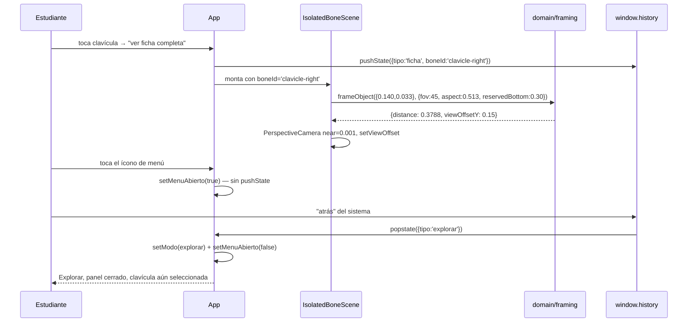

# Epic e9: Pulido de uso real — Docs

> Provisional — revise once a real run under this skill shows what the
> shape should actually be; do not treat this as a settled contract.

## Worked example

Un estudiante abre la ficha completa de la clavícula derecha en un
teléfono en vertical, abre el menú de créditos, y presiona "atrás" del
sistema. Este recorrido ejercita, en una sola secuencia, los tres
mecanismos que E9 introdujo: el encuadre por ancho (e9.3/e9.4), la
History API como transporte de `Modo` (e9.6, ADR-013) y el panel de menú
ajeno al historial (e9.7, ADR-016).

1. Desde Explorar, toca la clavícula derecha y luego "ver ficha
   completa". `App.navegar({ tipo: 'ficha', boneId: 'clavicle-right' })`
   (`src/App.tsx`) hace `window.history.pushState(siguiente, '')` y
   `setModo(siguiente)`. El historial pasa de 1 entrada sembrada
   (`{ tipo: 'explorar' }`, por `replaceState` al montar) a 2.
2. `IsolatedBoneScene` mide la caja mundial de la clavícula:
   **0,140 × 0,033** (ancho × alto), la malla más desproporcionada del
   modelo —ratio 4,26, medido sobre las 144 mallas reales en e9.3—.
   `useThree().size` da el aspecto real del lienzo, ya post-layout:
   **0,513** (más alto que ancho, típico de un teléfono en vertical).
3. `IsolatedGroup` llama a `frameObject({ width: 0.140, height: 0.033 },
   { fovDegrees: 45, aspect: 0.513, reservedBottom: 0.30 })`
   (`src/domain/framing.ts`) — la reserva es la fracción de lienzo que la
   tarjeta de la ficha tapa, medida por `useFraccionCubierta`
   (`src/components/useFraccionCubierta.ts`). La función prueba dos
   candidatos —por alto corregido por la reserva, por ancho corregido
   por el aspecto— y se queda con el mayor:
   - Por alto: `distanceToFit(0,033 / (1 − 0,30), 45°) ≈ 0,0654`.
   - Por ancho: `distanceToFit(0,140 / 0,513, 45°) ≈ 0,3788`.
   - **Gana el ancho.** `{ distance: 0,3788, viewOffsetY: 0,15 }`.
4. La cámara (`<PerspectiveCamera near={0.001}>`, `src/components/
   IsolatedBoneScene.tsx:159`) se posiciona a esa distancia y
   `setViewOffset` descentra la **proyección**, no la cámara —si moviera
   la cámara, el punto de órbita quedaría por debajo del hueso y girarlo
   lo sacaría del encuadre (hallazgo de e9.3, verificado a mano). El
   `near={0.001}` importa porque, para un hueso diminuto, la distancia
   calculada puede caer por debajo del `near` por defecto de three.js
   (0,1) y el hueso se recorta invisible (hallazgo de e9.4, medido en un
   hueso del tarso: `distance: 0,0588`).
5. El estudiante toca el ícono de menú (`MenuIcono`, ya no un `<div
   aria-hidden>` sino un `<button>` real, e9.7). `setMenuAbierto(true)`
   monta `AboutPanel` — estado local de `App`, **no** un `Modo`: no llama
   a `navegar`, el historial se queda en 2 entradas.
6. El estudiante presiona "atrás" del sistema (botón o gesto del
   teléfono). El navegador dispara `popstate` con el `state` de la
   entrada anterior (`{ tipo: 'explorar' }`). El handler
   `alRetroceder` (`src/App.tsx`) hace dos cosas en el mismo evento:
   `setModo(esModo(evento.state) ? evento.state : modoInicial())` **y**
   `setMenuAbierto(false)` — la segunda línea es el arreglo de e9.7 T6:
   sin ella, el panel se queda montado encima de Explorar en vez de
   cerrarse, exactamente el defecto que la verificación manual encontró.
7. La vista vuelve a Explorar, con la clavícula todavía marcada como
   seleccionada (`aria-pressed="true"`) — la selección vive en `App`
   desde antes de esta épica, ajena al historial por el mismo motivo que
   el panel.



## Extension guide

**Agregar un nuevo panel modal** (el patrón de `AboutPanel`, ADR-016):

1. Crear el componente con `role="dialog"`, `aria-modal="true"`,
   `aria-labelledby` apuntando a un `<h2>` con id propio, y `tabIndex={-1}`
   en el contenedor.
2. Un `useRef<HTMLDivElement>` + `useEffect` que llama a
   `panelRef.current?.focus()` al montar, y un listener de `keydown` para
   `Escape` que llama a `onClose`, limpiado al desmontar.
3. Un `<div>` de backdrop independiente, `aria-hidden="true"`, con su
   propio `onClick={onClose}`.
4. En el consumidor (por ahora, solo `App.tsx`): un `useState<boolean>`
   local, **nunca** un `Modo` nuevo — el panel no empuja historial.
5. **Si el consumidor puede navegar por fuera del panel** (como `App`, que
   escucha `popstate`), agregar el cierre del panel al mismo handler de
   navegación — ver el paso 6 del worked example. Este paso es fácil de
   olvidar porque el panel, por diseño, no sabe nada del historial; es
   justamente por eso que alguien más tiene que cerrarlo.
6. Probar con Testing Library de verdad —foco, `Escape`, clic en
   backdrop— no con lectura de código fuente: a diferencia de las escenas
   3D, esto es DOM plano (`AboutPanel.test.tsx` es la referencia).

**Error común:** un `{/* biome-ignore ... */}` como comentario JSX no
funciona — Biome solo reconoce `// biome-ignore regla: motivo` en una
línea, directamente adjunto al código que suprime.

**Agregar una reserva de cámara a una escena existente** (el patrón
`zoom?: { reservedBottom: number }` de `SkeletonScene`):

1. Agrupar cualquier dato de encuadre dinámico dentro de un solo prop
   opcional, nunca varios props sueltos — un tipo inválido (reserva sin
   zoom activo) no debe poder existir.
2. Con el prop ausente, el comportamiento por defecto no puede cambiar ni
   una línea — verificarlo con un diff vacío del componente que no pasa
   el prop (`ExploreView.tsx` no cambió en e9.4).
3. Usar `frameObject` (no reimplementar la aritmética) y pasar
   `zoom?.reservedBottom ?? 0`, nunca `zoom?.reservedBottom` solo —
   `undefined` rompe el encuadre por defecto.
4. No olvidar `near={0.001}` en el `<PerspectiveCamera>` si el objeto
   encuadrado puede ser pequeño — three.js recorta con `near=0.1` por
   defecto.

## Data flow

**Encuadre de cámara** (e9.3, e9.4):

```
geometría de la malla (Box3 world)
  → { width, height } (IsolatedBoneScene) / { y: altura } (SkeletonScene)
  → frameObject(size, ViewportFraming) — src/domain/framing.ts, puro
  → Framing { distance, viewOffsetY }
  → <PerspectiveCamera position position.z=distance> + camera.setViewOffset(...)
```

`ViewportFraming.reservedBottom` viene de `useFraccionCubierta`
(`src/components/useFraccionCubierta.ts`), que mide con `ResizeObserver`
cuánto del lienzo tapa la tarjeta flotante (ficha) o la barra de
respuesta (test) — extraído en e9.2, reutilizado por e9.3/e9.4.

**Nombre corto** (e9.5, ADR-014):

```
catalog[i].es (nombre completo, minúscula, dominio) — src/data/catalog.ts
  → shortName(es) — src/components/bone-name.ts, puro
  → visibleName(bone) (para grid/test/título) | fullName(bone) (aria-label, ficha)
```

`sideLabel`/concordancia de género usa `bone.gender: 'm' | 'f'`
(ADR-015), un campo del catálogo, nunca inferido de la terminación del
nombre.

**Navegación** (e9.6, ADR-013):

```
tap en la interfaz
  → navegar(modoSiguiente) — App.tsx
  → window.history.pushState(modoSiguiente, '') + setModo(modoSiguiente)
  → […]
  → «atrás» del sistema → evento popstate(state)
  → esModo(state) ? setModo(state) : setModo(modoInicial())
  → setMenuAbierto(false) — el panel de e9.7 no es un Modo, pero se cierra igual
```

## Invariants & contracts

- **El `Modo` viaja solo por `navegar`/`pushState`, nunca por un
  `setModo` suelto** (ADR-013). Síntoma de violación: el "atrás" del
  sistema salta una vista o revive una vieja. Cómo comprobarlo: grep de
  `setModo(` en `App.tsx` — solo debe aparecer en `navegar` y en
  `alRetroceder`.
- **`frameObject` nunca recibe `reservedBottom` como `undefined`
  implícito** — el llamador siempre normaliza con `?? 0`. Síntoma: el
  encuadre por defecto de `ExploreView` (sin tarjeta encima) se corre.
  Cómo comprobarlo: `grep 'reservedBottom \?? 0'` en `SkeletonScene.tsx`.
- **`updateMatrixWorld(true)` se llama sobre el padre con transformación
  propia, no sobre la copia que se mide** cuando la copia vive dentro de
  un `<group offset scale>` (patrón `CenteredSkeleton`, distinto de
  `IsolatedGroup`, que **es** la cima de su jerarquía). Síntoma: el
  esqueleto aparece fuera de cámara solo en el primer render de una
  carga fresca. Cómo comprobarlo: instrumentar
  `copia.parent?.matrixWorld.elements.slice(12,15)` en el punto donde se
  lee — `[0,0,0]` significa que el padre todavía no se actualizó.
- **Todo `<PerspectiveCamera>` que encuadra un objeto dinámico lleva
  `near={0.001}`.** Síntoma: un hueso chico se ve invisible al
  seleccionarlo. Cómo comprobarlo: loguear la `distance` que calcula
  `frameObject`/`distanceToFit` — si cae bajo 0,1 (el `near` por defecto
  de three.js), el objeto queda detrás del plano de recorte.
- **Ningún nombre corto pasa el techo declarado, y los nombres cortos
  del catálogo son únicos entre sí dentro de su familia** (ADR-014).
  Síntoma: dos huesos distintos muestran la misma etiqueta corta. Cómo
  comprobarlo: `bone-name.test.ts`, que corre sobre los 206 huesos reales
  del catálogo, no una muestra.
- **`AboutPanel` no llama a `navegar` ni toca `window.history` en ningún
  punto de su ciclo de vida** (ADR-016). Síntoma: `window.history.length`
  crece al abrir o cerrar el panel. Cómo comprobarlo:
  `App.test.tsx`, prueba "abrir y cerrar el panel no toca el historial".
- **Los localizadores de prueba por nombre corto usan igualdad exacta,
  nunca una regex sin anclar.** Síntoma: un test falla intermitentemente
  con "found multiple elements", con frecuencia proporcional a qué
  distractor sorteó `pickDistractors`. Cómo comprobarlo: correr el mismo
  test 30-50 veces seguidas; un defecto de regex-substring solo aparece
  quien saca el par exacto de nombres colisionantes.

## Failure-mode catalog

**Síntoma: un hueso chico se ve invisible al seleccionarlo, aunque el
resaltado 3D indica que está señalado.**
Causa raíz: el `near` por defecto de three.js (0,1) recorta cualquier
objeto cuya distancia calculada caiga por debajo — un hueso diminuto
(ej. una cuña del tarso) puede dar `distance: 0,0588`.
Diagnóstico: loguear `frameObject(...).distance` para el hueso en
cuestión; si es menor que 0,1, esta es la causa.
Fix: `near={0.001}` en el `<PerspectiveCamera>` — mismo valor que
`IsolatedBoneScene.tsx` ya usa desde e4.4.

**Síntoma: el esqueleto completo aparece con vista superior, fuera de
cámara, solo en la primera pregunta de una carga fresca del test —
después funciona bien.**
Causa raíz: `updateMatrixWorld(true)` se llamó sobre la copia medida en
vez de sobre su padre (`<group offset scale>` de `CenteredSkeleton`);
`updateMatrixWorld` propaga hacia abajo, nunca hacia arriba, así que en
el primer commit la matriz del padre todavía es la identidad.
Diagnóstico: instrumentar `copia.parent?.matrixWorld.elements.slice(12,
15)` en el punto donde se lee la caja — `[0,0,0]` confirma la causa.
Fix: `copia.parent?.updateMatrixWorld(true)`, no `copia.updateMatrixWorld
(true)`.

**Síntoma: un test de `TestQuestion` falla con "found multiple elements
with the text..." de forma intermitente, sin cambiar el código.**
Causa raíz: un matcher `new RegExp(shortName(...))` sin anclar hace
substring match; 5 pares de los 120 nombres cortos únicos son substring
uno del otro (ej. «1.ª vértebra torácica» ⊂ «11.ª vértebra torácica»).
El fallo depende de qué distractor sorteó `pickDistractors`, así que
parece flaky.
Diagnóstico: correr el test 30-50 veces seguidas; la tasa de fallo (no
cero, no consistente) es la firma del bug, no una prueba genuinamente
flaky.
Fix: comparar por igualdad exacta de texto (`` `✓ ${shortName(...)}` ``),
nunca por regex construida desde el nombre.

**Síntoma: el panel de menú se queda montado encima de la pantalla tras
presionar "atrás" del sistema, y la vista de fondo cambió pero el panel
no.**
Causa raíz: el panel es estado local (`menuAbierto`), deliberadamente
ajeno al historial — pero eso lo deja sin dueño ante un `popstate` real
si nadie lo cierra a propósito.
Diagnóstico: reproducir navegando a una vista real, abriendo el panel, y
presionando "atrás"; si el diálogo (`role="dialog"`) sigue en el DOM
después del `popstate`, esta es la causa.
Fix: el handler `alRetroceder` cierra el panel además de fijar el modo
(`setMenuAbierto(false)`).

**Síntoma: una prueba de un panel modal no puede verificar que el foco
entra ni que el fondo queda bloqueado, aunque el componente se vea bien
en el navegador.**
Causa raíz: el componente usa `<dialog>` nativo con `showModal()`, y la
versión de jsdom que el proyecto fija (30.0.1) no implementa
`HTMLDialogElement.prototype.showModal` — el elemento se comporta como
un `<div>` con un atributo `open`.
Diagnóstico: `node -e "console.log(HTMLDialogElement.prototype.showModal)"`
bajo la misma versión de jsdom — `undefined` confirma la causa.
Fix: overlay propio con `role="dialog"` (ver ADR-016 y la guía de
extensión arriba), no `<dialog>`.
